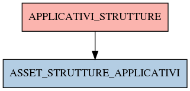

# APPLICATIVI_STRUTTURE

## Info tabella

| Info                     | Descrizione                                                                                                                         |
|:-------------------------|:------------------------------------------------------------------------------------------------------------------------------------|
| Nome tabella Dremio      | APPLICATIVI_STRUTTURE                                                                                                               |
| Space Dremio             | fbk_test1__CORE_DATASET                                                                                                             |
| Nome completo            | fbk_test1__CORE_DATASET.APPLICATIVI_STRUTTURE                                                                                       |
| Descrizione tabella      |                                                                                                                                     |
| Versione                 | 1.0                                                                                                                                 |
| Core dataset             | True                                                                                                                                |
| Dataset di origine       | APPLICATIVI                                                                                                                         |
| Richiede validazione     | True                                                                                                                                |
| Esposta in DSS           | False                                                                                                                               |
| Endpoint DSS             |                                                                                                                                     |
| Query name DSS           |                                                                                                                                     |
| Formato esposizione      |                                                                                                                                     |
| Tipologia autenticazione |                                                                                                                                     |
| Tabelle genitrici        |                                                                                                                                     |
| Tabelle figlie           | [fbk_test1__MASTER_DATA.ASSET_STRUTTURE_APPLICATIVI](/Documentation/fbk_test1__MASTER_DATA/ASSET_STRUTTURE_APPLICATIVI/markdown.md) |

## Struttura relazionale

## Descrizione struttura tabella

| Campo                               | Descrizione                         | Tipo     | Constraints   | Linked data   | errors   |
|:------------------------------------|:------------------------------------|:---------|:--------------|:--------------|:---------|
| appl_timestamp                      | Appl timestamp                      | datetime | {}            |               | {}       |
| appl_mail_responsabile              | Appl mail responsabile              | string   | {}            |               | {}       |
| appl_nome_struttura                 | Appl nome struttura                 | string   | {}            |               | {}       |
| appl_codice_struttura               | Appl codice struttura               | string   | {}            |               | {}       |
| appl_nome_struttura_primo_livello   | Appl nome struttura primo livello   | string   | {}            |               | {}       |
| appl_codice_struttura_primo_livello | Appl codice struttura primo livello | string   | {}            |               | {}       |
| appl_nome_applicativo               | Appl nome applicativo               | string   | {}            |               | {}       |
| appl_nome_applicativo_master        | Appl nome applicativo master        | string   | {}            |               | {}       |
| appl_descrizione_applicativo        | Appl descrizione applicativo        | string   | {}            |               | {}       |
| appl_funzioni_critiche_per_esterni  | Appl funzioni critiche per esterni  | string   | {}            |               | {}       |
| appl_tipologia_software             | Appl tipologia software             | string   | {}            |               | {}       |
| appl_fornitore_esterno              | Appl fornitore esterno              | string   | {}            |               | {}       |
| appl_inzio_contratto                | Appl inzio contratto                | string   | {}            |               | {}       |
| appl_scadenza_contratto             | Appl scadenza contratto             | string   | {}            |               | {}       |
| appl_produttore                     | Appl produttore                     | string   | {}            |               | {}       |
| appl_versione                       | Appl versione                       | string   | {}            |               | {}       |
| appl_tipologia_applicazione         | Appl tipologia applicazione         | string   | {}            |               | {}       |
| appl_modalita_installazione         | Appl modalita installazione         | string   | {}            |               | {}       |
| appl_tipologia_licenze              | Appl tipologia licenze              | string   | {}            |               | {}       |
| appl_numero_licenze                 | Appl numero licenze                 | integer  | {}            |               | {}       |
| appl_numero_utilizzatori            | Appl numero utilizzatori            | integer  | {}            |               | {}       |
| appl_piattaforma_tecnologica        | Appl piattaforma tecnologica        | string   | {}            |               | {}       |
| appl_ambiente_sviluppo              | Appl ambiente sviluppo              | string   | {}            |               | {}       |
| appl_interoperabilita_software      | Appl interoperabilita software      | string   | {}            |               | {}       |
| appl_frequenza_utilizzo             | Appl frequenza utilizzo             | string   | {}            |               | {}       |
| appl_impatto_dipartimento_servizio  | Appl impatto dipartimento servizio  | string   | {}            |               | {}       |
| appl_prospettive_medio_termine      | Appl prospettive medio termine      | string   | {}            |               | {}       |
| appl_provenienza_record             | Appl provenienza record             | string   | {}            |               | {}       |
| appl_macroarea                      | Appl macroarea                      | string   | {}            |               | {}       |
| appl_ambito_applicativo             | Appl ambito applicativo             | string   | {}            |               | {}       |
| appl_ulteriore_analisi              | Appl ulteriore analisi              | string   | {}            |               | {}       |
| appl_note                           | Appl note                           | string   | {}            |               | {}       |
| appl_da_cancellare                  | Appl da cancellare                  | string   | {}            |               | {}       |
| appl_dato_privacy                   | Appl dato privacy                   | string   | {}            |               | {}       |
| appl_dato_openData                  | Appl dato openData                  | string   | {}            |               | {}       |
