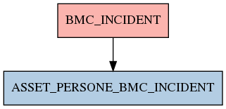

# BMC_INCIDENT

## Info tabella

| Info                     | Descrizione                                                                                                                       |
|:-------------------------|:----------------------------------------------------------------------------------------------------------------------------------|
| Nome tabella Dremio      | BMC_INCIDENT                                                                                                                      |
| Space Dremio             | fbk_test1__CORE_DATASET                                                                                                           |
| Nome completo            | fbk_test1__CORE_DATASET.BMC_INCIDENT                                                                                              |
| Descrizione tabella      |                                                                                                                                   |
| Versione                 | 1.0                                                                                                                               |
| Core dataset             | True                                                                                                                              |
| Dataset di origine       | BMC                                                                                                                               |
| Richiede validazione     | True                                                                                                                              |
| Esposta in DSS           | False                                                                                                                             |
| Endpoint DSS             |                                                                                                                                   |
| Query name DSS           |                                                                                                                                   |
| Formato esposizione      |                                                                                                                                   |
| Tipologia autenticazione |                                                                                                                                   |
| Tabelle genitrici        |                                                                                                                                   |
| Tabelle figlie           | [fbk_test1__MASTER_DATA.ASSET_PERSONE_BMC_INCIDENT](/Documentation/fbk_test1__MASTER_DATA/ASSET_PERSONE_BMC_INCIDENT/markdown.md) |

## Struttura relazionale

## Descrizione struttura tabella

| Campo                           | Descrizione                     | Tipo     | Constraints   | Linked data   | errors   |
|:--------------------------------|:--------------------------------|:---------|:--------------|:--------------|:---------|
| bmc_incident                    | Bmc incident                    | string   | {}            |               | {}       |
| bmc_company                     | Bmc company                     | string   | {}            |               | {}       |
| bmc_direct_contact_organization | Bmc direct contact organization | string   | {}            |               | {}       |
| bmc_direct_contact_departement  | Bmc direct contact departement  | string   | {}            |               | {}       |
| bmc_direct_contact_person_id    | Bmc direct contact person id    | string   | {}            |               | {}       |
| bmc_nome                        | Bmc nome                        | string   | {}            |               | {}       |
| bmc_cognome                     | Bmc cognome                     | string   | {}            |               | {}       |
| bmc_servizio                    | Bmc servizio                    | string   | {}            |               | {}       |
| bmc_status                      | Bmc status                      | string   | {}            |               | {}       |
| bmc_data_submission             | Bmc data submission             | datetime | {}            |               | {}       |
| bmc_data_risoluzione            | Bmc data risoluzione            | datetime | {}            |               | {}       |
| bmc_sommario                    | Bmc sommario                    | string   | {}            |               | {}       |
| bmc_note                        | Bmc note                        | string   | {}            |               | {}       |
| bmc_risoluzione                 | Bmc risoluzione                 | string   | {}            |               | {}       |
