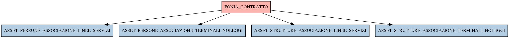

# FONIA_CONTRATTO

## Info tabella

| Info                     | Descrizione                                                                                                                                                 |
|:-------------------------|:------------------------------------------------------------------------------------------------------------------------------------------------------------|
| Nome tabella Dremio      | FONIA_CONTRATTO                                                                                                                                             |
| Space Dremio             | fbk_test1__CORE_DATASET                                                                                                                                     |
| Nome completo            | fbk_test1__CORE_DATASET.FONIA_CONTRATTO                                                                                                                     |
| Descrizione tabella      |                                                                                                                                                             |
| Versione                 | 1.0                                                                                                                                                         |
| Core dataset             | True                                                                                                                                                        |
| Dataset di origine       | FONIA                                                                                                                                                       |
| Richiede validazione     | True                                                                                                                                                        |
| Esposta in DSS           | False                                                                                                                                                       |
| Endpoint DSS             |                                                                                                                                                             |
| Query name DSS           |                                                                                                                                                             |
| Formato esposizione      |                                                                                                                                                             |
| Tipologia autenticazione |                                                                                                                                                             |
| Tabelle genitrici        |                                                                                                                                                             |
| Tabelle figlie           | [fbk_test1__MASTER_DATA.ASSET_PERSONE_ASSOCIAZIONE_LINEE_SERVIZI](/fbk_test1__MASTER_DATA/ASSET_PERSONE_ASSOCIAZIONE_LINEE_SERVIZI/markdown.md)             |
|                          | [fbk_test1__MASTER_DATA.ASSET_PERSONE_ASSOCIAZIONE_TERMINALI_NOLEGGI](/fbk_test1__MASTER_DATA/ASSET_PERSONE_ASSOCIAZIONE_TERMINALI_NOLEGGI/markdown.md)     |
|                          | [fbk_test1__MASTER_DATA.ASSET_STRUTTURE_ASSOCIAZIONE_LINEE_SERVIZI](/fbk_test1__MASTER_DATA/ASSET_STRUTTURE_ASSOCIAZIONE_LINEE_SERVIZI/markdown.md)         |
|                          | [fbk_test1__MASTER_DATA.ASSET_STRUTTURE_ASSOCIAZIONE_TERMINALI_NOLEGGI](/fbk_test1__MASTER_DATA/ASSET_STRUTTURE_ASSOCIAZIONE_TERMINALI_NOLEGGI/markdown.md) |

## Struttura relazionale

## Descrizione struttura tabella

| Campo                        | Descrizione                  | Tipo    | Constraints   | Linked data   | errors   |
|:-----------------------------|:-----------------------------|:--------|:--------------|:--------------|:---------|
| id                           | Id                           | integer | {}            |               | {}       |
| data_primo_inserimento       | Data primo inserimento       | date    | {}            |               | {}       |
| data_ultima_modifica         | Data ultima modifica         | date    | {}            |               | {}       |
| data_fine_contratto          | Data fine contratto          | date    | {}            |               | {}       |
| data_inizio_contratto        | Data inizio contratto        | date    | {}            |               | {}       |
| codice_riferimento_contratto | Codice riferimento contratto | string  | {}            |               | {}       |
| descrizione_contratto        | Descrizione contratto        | string  | {}            |               | {}       |
| operatore                    | Operatore                    | string  | {}            |               | {}       |
| referente_contratto          | Referente contratto          | string  | {}            |               | {}       |
| ricaricabile                 | Ricaricabile                 | integer | {}            |               | {}       |
