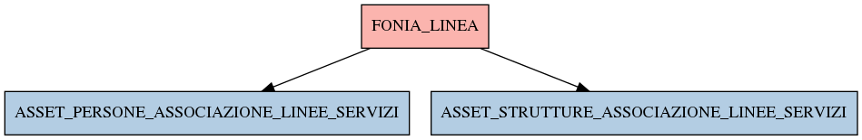

# FONIA_LINEA

## Info tabella

| Info                     | Descrizione                                                                                                                                                       |
|:-------------------------|:------------------------------------------------------------------------------------------------------------------------------------------------------------------|
| Nome tabella Dremio      | FONIA_LINEA                                                                                                                                                       |
| Space Dremio             | fbk_test1__CORE_DATASET                                                                                                                                           |
| Nome completo            | fbk_test1__CORE_DATASET.FONIA_LINEA                                                                                                                               |
| Descrizione tabella      |                                                                                                                                                                   |
| Versione                 | 1.0                                                                                                                                                               |
| Core dataset             | True                                                                                                                                                              |
| Dataset di origine       | FONIA                                                                                                                                                             |
| Richiede validazione     | True                                                                                                                                                              |
| Esposta in DSS           | False                                                                                                                                                             |
| Endpoint DSS             |                                                                                                                                                                   |
| Query name DSS           |                                                                                                                                                                   |
| Formato esposizione      |                                                                                                                                                                   |
| Tipologia autenticazione |                                                                                                                                                                   |
| Tabelle genitrici        |                                                                                                                                                                   |
| Tabelle figlie           | [fbk_test1__MASTER_DATA.ASSET_PERSONE_ASSOCIAZIONE_LINEE_SERVIZI](/Documentation/fbk_test1__MASTER_DATA/ASSET_PERSONE_ASSOCIAZIONE_LINEE_SERVIZI/markdown.md)     |
|                          | [fbk_test1__MASTER_DATA.ASSET_STRUTTURE_ASSOCIAZIONE_LINEE_SERVIZI](/Documentation/fbk_test1__MASTER_DATA/ASSET_STRUTTURE_ASSOCIAZIONE_LINEE_SERVIZI/markdown.md) |

## Struttura relazionale

## Descrizione struttura tabella

| Campo                  | Descrizione            | Tipo    | Constraints   | Linked data   | errors   |
|:-----------------------|:-----------------------|:--------|:--------------|:--------------|:---------|
| id                     | Id                     | integer | {}            |               | {}       |
| numero_telefono        | Numero telefono        | string  | {}            |               | {}       |
| stato_linea            | Stato linea            | string  | {}            |               | {}       |
| contratto_id           | Contratto id           | integer | {}            |               | {}       |
| tipologia_id           | Tipologia id           | integer | {}            |               | {}       |
| data_primo_inserimento | Data primo inserimento | date    | {}            |               | {}       |
| data_ultima_modifica   | Data ultima modifica   | date    | {}            |               | {}       |
