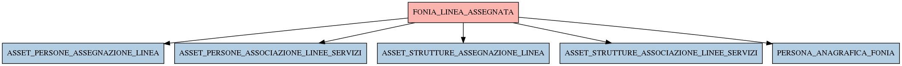

# FONIA_LINEA_ASSEGNATA

## Info tabella

| Info                     | Descrizione                                                                                                                                         |
|:-------------------------|:----------------------------------------------------------------------------------------------------------------------------------------------------|
| Nome tabella Dremio      | FONIA_LINEA_ASSEGNATA                                                                                                                               |
| Space Dremio             | fbk_test1__CORE_DATASET                                                                                                                             |
| Nome completo            | fbk_test1__CORE_DATASET.FONIA_LINEA_ASSEGNATA                                                                                                       |
| Descrizione tabella      |                                                                                                                                                     |
| Versione                 | 1.0                                                                                                                                                 |
| Core dataset             | True                                                                                                                                                |
| Dataset di origine       | FONIA                                                                                                                                               |
| Richiede validazione     | True                                                                                                                                                |
| Esposta in DSS           | False                                                                                                                                               |
| Endpoint DSS             |                                                                                                                                                     |
| Query name DSS           |                                                                                                                                                     |
| Formato esposizione      |                                                                                                                                                     |
| Tipologia autenticazione |                                                                                                                                                     |
| Tabelle genitrici        |                                                                                                                                                     |
| Tabelle figlie           | [fbk_test1__MASTER_DATA.ASSET_PERSONE_ASSEGNAZIONE_LINEA](/fbk_test1__MASTER_DATA/ASSET_PERSONE_ASSEGNAZIONE_LINEA/markdown.md)                     |
|                          | [fbk_test1__MASTER_DATA.ASSET_PERSONE_ASSOCIAZIONE_LINEE_SERVIZI](/fbk_test1__MASTER_DATA/ASSET_PERSONE_ASSOCIAZIONE_LINEE_SERVIZI/markdown.md)     |
|                          | [fbk_test1__MASTER_DATA.ASSET_STRUTTURE_ASSEGNAZIONE_LINEA](/fbk_test1__MASTER_DATA/ASSET_STRUTTURE_ASSEGNAZIONE_LINEA/markdown.md)                 |
|                          | [fbk_test1__MASTER_DATA.ASSET_STRUTTURE_ASSOCIAZIONE_LINEE_SERVIZI](/fbk_test1__MASTER_DATA/ASSET_STRUTTURE_ASSOCIAZIONE_LINEE_SERVIZI/markdown.md) |
|                          | [fbk_test1__MASTER_DATA.PERSONA_ANAGRAFICA_FONIA](/fbk_test1__MASTER_DATA/PERSONA_ANAGRAFICA_FONIA/markdown.md)                                     |

## Struttura relazionale

## Descrizione struttura tabella

| Campo                          | Descrizione                    | Tipo    | Constraints   | Linked data   | errors   |
|:-------------------------------|:-------------------------------|:--------|:--------------|:--------------|:---------|
| id                             | Id                             | integer | {}            |               | {}       |
| data_primo_inserimento         | Data primo inserimento         | date    | {}            |               | {}       |
| data_ultima_modifica           | Data ultima modifica           | date    | {}            |               | {}       |
| data_fine_assegnazione_linea   | Data fine assegnazione linea   | date    | {}            |               | {}       |
| data_inizio_assegnazione_linea | Data inizio assegnazione linea | date    | {}            |               | {}       |
| linea_is_personale             | Linea is personale             | integer | {}            |               | {}       |
| gruppo_id                      | Gruppo id                      | integer | {}            |               | {}       |
| persona_id                     | Persona id                     | integer | {}            |               | {}       |
| struttura_id                   | Struttura id                   | integer | {}            |               | {}       |
| causale_ritiro                 | Causale ritiro                 | string  | {}            |               | {}       |
| linea_id                       | Linea id                       | integer | {}            |               | {}       |
| tipologia_id                   | Tipologia id                   | integer | {}            |               | {}       |
