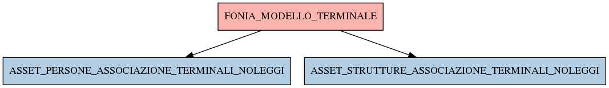

# FONIA_MODELLO_TERMINALE

## Info tabella

| Info                     | Descrizione                                                                                                                                                               |
|:-------------------------|:--------------------------------------------------------------------------------------------------------------------------------------------------------------------------|
| Nome tabella Dremio      | FONIA_MODELLO_TERMINALE                                                                                                                                                   |
| Space Dremio             | fbk_test1__CORE_DATASET                                                                                                                                                   |
| Nome completo            | fbk_test1__CORE_DATASET.FONIA_MODELLO_TERMINALE                                                                                                                           |
| Descrizione tabella      |                                                                                                                                                                           |
| Versione                 | 1.0                                                                                                                                                                       |
| Core dataset             | True                                                                                                                                                                      |
| Dataset di origine       | FONIA                                                                                                                                                                     |
| Richiede validazione     | True                                                                                                                                                                      |
| Esposta in DSS           | False                                                                                                                                                                     |
| Endpoint DSS             |                                                                                                                                                                           |
| Query name DSS           |                                                                                                                                                                           |
| Formato esposizione      |                                                                                                                                                                           |
| Tipologia autenticazione |                                                                                                                                                                           |
| Tabelle genitrici        |                                                                                                                                                                           |
| Tabelle figlie           | [fbk_test1__MASTER_DATA.ASSET_PERSONE_ASSOCIAZIONE_TERMINALI_NOLEGGI](/Documentation/fbk_test1__MASTER_DATA/ASSET_PERSONE_ASSOCIAZIONE_TERMINALI_NOLEGGI/markdown.md)     |
|                          | [fbk_test1__MASTER_DATA.ASSET_STRUTTURE_ASSOCIAZIONE_TERMINALI_NOLEGGI](/Documentation/fbk_test1__MASTER_DATA/ASSET_STRUTTURE_ASSOCIAZIONE_TERMINALI_NOLEGGI/markdown.md) |

## Struttura relazionale

## Descrizione struttura tabella

| Campo                             | Descrizione                       | Tipo    | Constraints   | Linked data   | errors   |
|:----------------------------------|:----------------------------------|:--------|:--------------|:--------------|:---------|
| id                                | Id                                | integer | {}            |               | {}       |
| descrizione_modello_terminale     | Descrizione modello terminale     | string  | {}            |               | {}       |
| caratteristiche_modello_terminale | Caratteristiche modello terminale | string  | {}            |               | {}       |
| peso_modello_terminale            | Peso modello terminale            | string  | {}            |               | {}       |
| fascia_id                         | Fascia id                         | integer | {}            |               | {}       |
| marca_id                          | Marca id                          | integer | {}            |               | {}       |
| tipologia_id                      | Tipologia id                      | integer | {}            |               | {}       |
