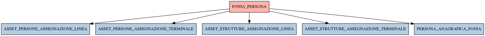

# FONIA_PERSONA

## Info tabella

| Info                     | Descrizione                                                                                                                                 |
|:-------------------------|:--------------------------------------------------------------------------------------------------------------------------------------------|
| Nome tabella Dremio      | FONIA_PERSONA                                                                                                                               |
| Space Dremio             | fbk_test1__CORE_DATASET                                                                                                                     |
| Nome completo            | fbk_test1__CORE_DATASET.FONIA_PERSONA                                                                                                       |
| Descrizione tabella      |                                                                                                                                             |
| Versione                 | 1.0                                                                                                                                         |
| Core dataset             | True                                                                                                                                        |
| Dataset di origine       | FONIA                                                                                                                                       |
| Richiede validazione     | True                                                                                                                                        |
| Esposta in DSS           | False                                                                                                                                       |
| Endpoint DSS             |                                                                                                                                             |
| Query name DSS           |                                                                                                                                             |
| Formato esposizione      |                                                                                                                                             |
| Tipologia autenticazione |                                                                                                                                             |
| Tabelle genitrici        |                                                                                                                                             |
| Tabelle figlie           | [fbk_test1__MASTER_DATA.ASSET_PERSONE_ASSEGNAZIONE_LINEA](/fbk_test1__MASTER_DATA/ASSET_PERSONE_ASSEGNAZIONE_LINEA/markdown.md)             |
|                          | [fbk_test1__MASTER_DATA.ASSET_PERSONE_ASSEGNAZIONE_TERMINALE](/fbk_test1__MASTER_DATA/ASSET_PERSONE_ASSEGNAZIONE_TERMINALE/markdown.md)     |
|                          | [fbk_test1__MASTER_DATA.ASSET_STRUTTURE_ASSEGNAZIONE_LINEA](/fbk_test1__MASTER_DATA/ASSET_STRUTTURE_ASSEGNAZIONE_LINEA/markdown.md)         |
|                          | [fbk_test1__MASTER_DATA.ASSET_STRUTTURE_ASSEGNAZIONE_TERMINALE](/fbk_test1__MASTER_DATA/ASSET_STRUTTURE_ASSEGNAZIONE_TERMINALE/markdown.md) |
|                          | [fbk_test1__MASTER_DATA.PERSONA_ANAGRAFICA_FONIA](/fbk_test1__MASTER_DATA/PERSONA_ANAGRAFICA_FONIA/markdown.md)                             |

## Struttura relazionale

## Descrizione struttura tabella

| Campo          | Descrizione    | Tipo    | Constraints   | Linked data   | errors   |
|:---------------|:---------------|:--------|:--------------|:--------------|:---------|
| id             | Id             | integer | {}            |               | {}       |
| codice_fiscale | Codice fiscale | string  | {}            |               | {}       |
| cognome        | Cognome        | string  | {}            |               | {}       |
| mail           | Mail           | string  | {}            |               | {}       |
| matricola      | Matricola      | string  | {}            |               | {}       |
| nome           | Nome           | string  | {}            |               | {}       |
| struttura_id   | Struttura id   | integer | {}            |               | {}       |
| provenienza    | Provenienza    | string  | {}            |               | {}       |
