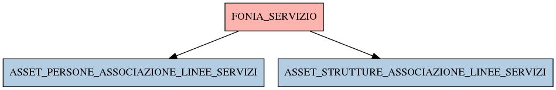

# FONIA_SERVIZIO

## Info tabella

| Info                     | Descrizione                                                                                                                                         |
|:-------------------------|:----------------------------------------------------------------------------------------------------------------------------------------------------|
| Nome tabella Dremio      | FONIA_SERVIZIO                                                                                                                                      |
| Space Dremio             | fbk_test1__CORE_DATASET                                                                                                                             |
| Nome completo            | fbk_test1__CORE_DATASET.FONIA_SERVIZIO                                                                                                              |
| Descrizione tabella      |                                                                                                                                                     |
| Versione                 | 1.0                                                                                                                                                 |
| Core dataset             | True                                                                                                                                                |
| Dataset di origine       | FONIA                                                                                                                                               |
| Richiede validazione     | True                                                                                                                                                |
| Esposta in DSS           | False                                                                                                                                               |
| Endpoint DSS             |                                                                                                                                                     |
| Query name DSS           |                                                                                                                                                     |
| Formato esposizione      |                                                                                                                                                     |
| Tipologia autenticazione |                                                                                                                                                     |
| Tabelle genitrici        |                                                                                                                                                     |
| Tabelle figlie           | [fbk_test1__MASTER_DATA.ASSET_PERSONE_ASSOCIAZIONE_LINEE_SERVIZI](/fbk_test1__MASTER_DATA/ASSET_PERSONE_ASSOCIAZIONE_LINEE_SERVIZI/markdown.md)     |
|                          | [fbk_test1__MASTER_DATA.ASSET_STRUTTURE_ASSOCIAZIONE_LINEE_SERVIZI](/fbk_test1__MASTER_DATA/ASSET_STRUTTURE_ASSOCIAZIONE_LINEE_SERVIZI/markdown.md) |

## Struttura relazionale

## Descrizione struttura tabella

| Campo                | Descrizione          | Tipo    | Constraints   | Linked data   | errors   |
|:---------------------|:---------------------|:--------|:--------------|:--------------|:---------|
| id                   | Id                   | integer | {}            |               | {}       |
| descrizione_servizio | Descrizione servizio | string  | {}            |               | {}       |
| canone_servizio      | Canone servizio      | number  | {}            |               | {}       |
| codice_servizio      | Codice servizio      | string  | {}            |               | {}       |
| servizio_is_gratuito | Servizio is gratuito | integer | {}            |               | {}       |
| tipo_canone_servizio | Tipo canone servizio | string  | {}            |               | {}       |
| contratto_id         | Contratto id         | integer | {}            |               | {}       |
