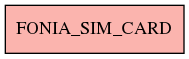

# FONIA_SIM_CARD

## Info tabella

| Info                     | Descrizione                            |
|:-------------------------|:---------------------------------------|
| Nome tabella Dremio      | FONIA_SIM_CARD                         |
| Space Dremio             | fbk_test1__CORE_DATASET                |
| Nome completo            | fbk_test1__CORE_DATASET.FONIA_SIM_CARD |
| Descrizione tabella      |                                        |
| Versione                 | 1.0                                    |
| Core dataset             | True                                   |
| Dataset di origine       | FONIA                                  |
| Richiede validazione     | True                                   |
| Esposta in DSS           | False                                  |
| Endpoint DSS             |                                        |
| Query name DSS           |                                        |
| Formato esposizione      |                                        |
| Tipologia autenticazione |                                        |
| Tabelle genitrici        |                                        |
| Tabelle figlie           |                                        |

## Struttura relazionale

## Descrizione struttura tabella

| Campo                  | Descrizione            | Tipo    | Constraints   | Linked data   | errors   |
|:-----------------------|:-----------------------|:--------|:--------------|:--------------|:---------|
| id                     | Id                     | integer | {}            |               | {}       |
| data_primo_inserimento | Data primo inserimento | date    | {}            |               | {}       |
| data_ultima_modifica   | Data ultima modifica   | date    | {}            |               | {}       |
| data_fine              | Data fine              | date    | {}            |               | {}       |
| data_inizio            | Data inizio            | date    | {}            |               | {}       |
| e_sim                  | E sim                  | integer | {}            |               | {}       |
| iccid                  | Iccid                  | string  | {}            |               | {}       |
| kb                     | Kb                     | integer | {}            |               | {}       |
| note                   | Note                   | string  | {}            |               | {}       |
| twin_card              | Twin card              | integer | {}            |               | {}       |
| linea_id               | Linea id               | integer | {}            |               | {}       |
