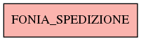

# FONIA_SPEDIZIONE

## Info tabella

| Info                     | Descrizione                              |
|:-------------------------|:-----------------------------------------|
| Nome tabella Dremio      | FONIA_SPEDIZIONE                         |
| Space Dremio             | fbk_test1__CORE_DATASET                  |
| Nome completo            | fbk_test1__CORE_DATASET.FONIA_SPEDIZIONE |
| Descrizione tabella      |                                          |
| Versione                 | 1.0                                      |
| Core dataset             | True                                     |
| Dataset di origine       | FONIA                                    |
| Richiede validazione     | True                                     |
| Esposta in DSS           | False                                    |
| Endpoint DSS             |                                          |
| Query name DSS           |                                          |
| Formato esposizione      |                                          |
| Tipologia autenticazione |                                          |
| Tabelle genitrici        |                                          |
| Tabelle figlie           |                                          |

## Struttura relazionale

## Descrizione struttura tabella

| Campo                  | Descrizione            | Tipo    | Constraints   | Linked data   | errors   |
|:-----------------------|:-----------------------|:--------|:--------------|:--------------|:---------|
| id                     | Id                     | integer | {}            |               | {}       |
| data_primo_inserimento | Data primo inserimento | date    | {}            |               | {}       |
| data_ultima_modifica   | Data ultima modifica   | date    | {}            |               | {}       |
| data_fine_spedizione   | Data fine spedizione   | date    | {}            |               | {}       |
| data_inizio_spedizione | Data inizio spedizione | date    | {}            |               | {}       |
| note_spedizione        | Note spedizione        | string  | {}            |               | {}       |
| peso_spedizione        | Peso spedizione        | number  | {}            |               | {}       |
| destinatario_id        | Destinatario id        | integer | {}            |               | {}       |
| richiesta_reintegro    | Richiesta reintegro    | integer | {}            |               | {}       |
