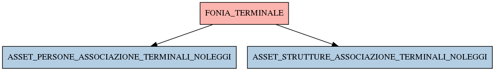

# FONIA_TERMINALE

## Info tabella

| Info                     | Descrizione                                                                                                                                                               |
|:-------------------------|:--------------------------------------------------------------------------------------------------------------------------------------------------------------------------|
| Nome tabella Dremio      | FONIA_TERMINALE                                                                                                                                                           |
| Space Dremio             | fbk_test1__CORE_DATASET                                                                                                                                                   |
| Nome completo            | fbk_test1__CORE_DATASET.FONIA_TERMINALE                                                                                                                                   |
| Descrizione tabella      |                                                                                                                                                                           |
| Versione                 | 1.0                                                                                                                                                                       |
| Core dataset             | True                                                                                                                                                                      |
| Dataset di origine       | FONIA                                                                                                                                                                     |
| Richiede validazione     | True                                                                                                                                                                      |
| Esposta in DSS           | False                                                                                                                                                                     |
| Endpoint DSS             |                                                                                                                                                                           |
| Query name DSS           |                                                                                                                                                                           |
| Formato esposizione      |                                                                                                                                                                           |
| Tipologia autenticazione |                                                                                                                                                                           |
| Tabelle genitrici        |                                                                                                                                                                           |
| Tabelle figlie           | [fbk_test1__MASTER_DATA.ASSET_PERSONE_ASSOCIAZIONE_TERMINALI_NOLEGGI](/Documentation/fbk_test1__MASTER_DATA/ASSET_PERSONE_ASSOCIAZIONE_TERMINALI_NOLEGGI/markdown.md)     |
|                          | [fbk_test1__MASTER_DATA.ASSET_STRUTTURE_ASSOCIAZIONE_TERMINALI_NOLEGGI](/Documentation/fbk_test1__MASTER_DATA/ASSET_STRUTTURE_ASSOCIAZIONE_TERMINALI_NOLEGGI/markdown.md) |

## Struttura relazionale

## Descrizione struttura tabella

| Campo                         | Descrizione                   | Tipo    | Constraints   | Linked data   | errors   |
|:------------------------------|:------------------------------|:--------|:--------------|:--------------|:---------|
| id                            | Id                            | integer | {}            |               | {}       |
| data_primo_inserimento        | Data primo inserimento        | date    | {}            |               | {}       |
| data_ultima_modifica          | Data ultima modifica          | date    | {}            |               | {}       |
| data_fine_terminale           | Data fine terminale           | date    | {}            |               | {}       |
| data_inizio_terminale         | Data inizio terminale         | date    | {}            |               | {}       |
| descrizione_guasto_terminale  | Descrizione guasto terminale  | string  | {}            |               | {}       |
| imei                          | Imei                          | string  | {}            |               | {}       |
| terminale_is_riscattato       | Terminale is riscattato       | integer | {}            |               | {}       |
| stato_terminale               | Stato terminale               | string  | {}            |               | {}       |
| contratto_id                  | Contratto id                  | integer | {}            |               | {}       |
| modello_id                    | Modello id                    | integer | {}            |               | {}       |
| spedizione_id                 | Spedizione id                 | integer | {}            |               | {}       |
| terminale_is_sostituito       | Terminale is sostituito       | integer | {}            |               | {}       |
| richiesta_reintegro_terminale | Richiesta reintegro terminale | string  | {}            |               | {}       |
