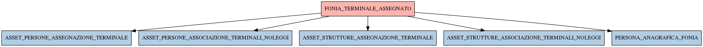

# FONIA_TERMINALE_ASSEGNATO

## Info tabella

| Info                     | Descrizione                                                                                                                                                               |
|:-------------------------|:--------------------------------------------------------------------------------------------------------------------------------------------------------------------------|
| Nome tabella Dremio      | FONIA_TERMINALE_ASSEGNATO                                                                                                                                                 |
| Space Dremio             | fbk_test1__CORE_DATASET                                                                                                                                                   |
| Nome completo            | fbk_test1__CORE_DATASET.FONIA_TERMINALE_ASSEGNATO                                                                                                                         |
| Descrizione tabella      |                                                                                                                                                                           |
| Versione                 | 1.0                                                                                                                                                                       |
| Core dataset             | True                                                                                                                                                                      |
| Dataset di origine       | FONIA                                                                                                                                                                     |
| Richiede validazione     | True                                                                                                                                                                      |
| Esposta in DSS           | False                                                                                                                                                                     |
| Endpoint DSS             |                                                                                                                                                                           |
| Query name DSS           |                                                                                                                                                                           |
| Formato esposizione      |                                                                                                                                                                           |
| Tipologia autenticazione |                                                                                                                                                                           |
| Tabelle genitrici        |                                                                                                                                                                           |
| Tabelle figlie           | [fbk_test1__MASTER_DATA.ASSET_PERSONE_ASSEGNAZIONE_TERMINALE](/Documentation/fbk_test1__MASTER_DATA/ASSET_PERSONE_ASSEGNAZIONE_TERMINALE/markdown.md)                     |
|                          | [fbk_test1__MASTER_DATA.ASSET_PERSONE_ASSOCIAZIONE_TERMINALI_NOLEGGI](/Documentation/fbk_test1__MASTER_DATA/ASSET_PERSONE_ASSOCIAZIONE_TERMINALI_NOLEGGI/markdown.md)     |
|                          | [fbk_test1__MASTER_DATA.ASSET_STRUTTURE_ASSEGNAZIONE_TERMINALE](/Documentation/fbk_test1__MASTER_DATA/ASSET_STRUTTURE_ASSEGNAZIONE_TERMINALE/markdown.md)                 |
|                          | [fbk_test1__MASTER_DATA.ASSET_STRUTTURE_ASSOCIAZIONE_TERMINALI_NOLEGGI](/Documentation/fbk_test1__MASTER_DATA/ASSET_STRUTTURE_ASSOCIAZIONE_TERMINALI_NOLEGGI/markdown.md) |
|                          | [fbk_test1__MASTER_DATA.PERSONA_ANAGRAFICA_FONIA](/Documentation/fbk_test1__MASTER_DATA/PERSONA_ANAGRAFICA_FONIA/markdown.md)                                             |

## Struttura relazionale

## Descrizione struttura tabella

| Campo                              | Descrizione                        | Tipo    | Constraints   | Linked data   | errors   |
|:-----------------------------------|:-----------------------------------|:--------|:--------------|:--------------|:---------|
| id                                 | Id                                 | integer | {}            |               | {}       |
| data_primo_inserimento             | Data primo inserimento             | date    | {}            |               | {}       |
| data_ultima_modifica               | Data ultima modifica               | date    | {}            |               | {}       |
| data_fine_assegnazione_terminale   | Data fine assegnazione terminale   | date    | {}            |               | {}       |
| data_inizio_assegnazione_terminale | Data inizio assegnazione terminale | date    | {}            |               | {}       |
| terminale_is_personale             | Terminale is personale             | integer | {}            |               | {}       |
| gruppo_id                          | Gruppo id                          | integer | {}            |               | {}       |
| persona_id                         | Persona id                         | integer | {}            |               | {}       |
| struttura_id                       | Struttura id                       | integer | {}            |               | {}       |
| causale_ritiro_terminale           | Causale ritiro terminale           | string  | {}            |               | {}       |
| terminale_id                       | Terminale id                       | integer | {}            |               | {}       |
