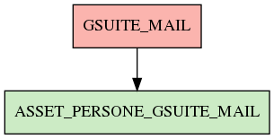

# GSUITE_MAIL

## Info tabella

| Info                     | Descrizione                                                                                                                                       |
|:-------------------------|:--------------------------------------------------------------------------------------------------------------------------------------------------|
| Nome tabella Dremio      | GSUITE_MAIL                                                                                                                                       |
| Space Dremio             | fbk_test1__CORE_DATASET                                                                                                                           |
| Nome completo            | fbk_test1__CORE_DATASET.GSUITE_MAIL                                                                                                               |
| Descrizione tabella      |                                                                                                                                                   |
| Versione                 | 1.0                                                                                                                                               |
| Core dataset             | True                                                                                                                                              |
| Dataset di origine       | GSUITE                                                                                                                                            |
| Richiede validazione     | True                                                                                                                                              |
| Esposta in DSS           | False                                                                                                                                             |
| Endpoint DSS             |                                                                                                                                                   |
| Query name DSS           |                                                                                                                                                   |
| Formato esposizione      |                                                                                                                                                   |
| Tipologia autenticazione |                                                                                                                                                   |
| Tabelle genitrici        |                                                                                                                                                   |
| Tabelle figlie           | [fbk_test1__VISUALIZATION_TABLES.ASSET_PERSONE_GSUITE_MAIL](/Documentation/fbk_test1__VISUALIZATION_TABLES/ASSET_PERSONE_GSUITE_MAIL/markdown.md) |

## Struttura relazionale

## Descrizione struttura tabella

| Campo                         | Descrizione                   | Tipo     | Constraints   | Linked data   | errors   |
|:------------------------------|:------------------------------|:---------|:--------------|:--------------|:---------|
| mail_istituzionale            | Mail istituzionale            | string   | {}            |               | {}       |
| gsuite_data_aggregazione_mail | Gsuite data aggregazione mail | datetime | {}            |               | {}       |
| gsuite_mail_inviate           | Gsuite mail inviate           | integer  | {}            |               | {}       |
| gsuite_mail_ricevute          | Gsuite mail ricevute          | integer  | {}            |               | {}       |
