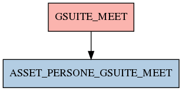

# GSUITE_MEET

## Info tabella

| Info                     | Descrizione                                                                                                       |
|:-------------------------|:------------------------------------------------------------------------------------------------------------------|
| Nome tabella Dremio      | GSUITE_MEET                                                                                                       |
| Space Dremio             | fbk_test1__CORE_DATASET                                                                                           |
| Nome completo            | fbk_test1__CORE_DATASET.GSUITE_MEET                                                                               |
| Descrizione tabella      |                                                                                                                   |
| Versione                 | 1.0                                                                                                               |
| Core dataset             | True                                                                                                              |
| Dataset di origine       | GSUITE                                                                                                            |
| Richiede validazione     | True                                                                                                              |
| Esposta in DSS           | False                                                                                                             |
| Endpoint DSS             |                                                                                                                   |
| Query name DSS           |                                                                                                                   |
| Formato esposizione      |                                                                                                                   |
| Tipologia autenticazione |                                                                                                                   |
| Tabelle genitrici        |                                                                                                                   |
| Tabelle figlie           | [fbk_test1__MASTER_DATA.ASSET_PERSONE_GSUITE_MEET](/fbk_test1__MASTER_DATA/ASSET_PERSONE_GSUITE_MEET/markdown.md) |

## Struttura relazionale

## Descrizione struttura tabella

| Campo                            | Descrizione                      | Tipo    | Constraints   | Linked data   | errors   |
|:---------------------------------|:---------------------------------|:--------|:--------------|:--------------|:---------|
| gsuite_data_meet                 | Gsuite data meet                 | date    | {}            |               | {}       |
| gsuite_codice_meet               | Gsuite codice meet               | string  | {}            |               | {}       |
| gsuite_mail_istituzionale        | Gsuite mail istituzionale        | string  | {}            |               | {}       |
| gsuite_durata_meet               | Gsuite durata meet               | integer | {}            |               | {}       |
| gsuite_paese                     | Gsuite paese                     | string  | {}            |               | {}       |
| larghezza_banda_caricamento_kbps | Larghezza banda caricamento kbps | integer | {}            |               | {}       |
| larghezza_banda_download_kbps    | Larghezza banda download kbps    | integer | {}            |               | {}       |
