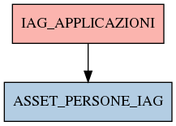

# IAG_APPLICAZIONI

## Info tabella

| Info                     | Descrizione                                                                                       |
|:-------------------------|:--------------------------------------------------------------------------------------------------|
| Nome tabella Dremio      | IAG_APPLICAZIONI                                                                                  |
| Space Dremio             | fbk_test1__CORE_DATASET                                                                           |
| Nome completo            | fbk_test1__CORE_DATASET.IAG_APPLICAZIONI                                                          |
| Descrizione tabella      |                                                                                                   |
| Versione                 | 1.0                                                                                               |
| Core dataset             | True                                                                                              |
| Dataset di origine       | IAG                                                                                               |
| Richiede validazione     | True                                                                                              |
| Esposta in DSS           | False                                                                                             |
| Endpoint DSS             |                                                                                                   |
| Query name DSS           |                                                                                                   |
| Formato esposizione      |                                                                                                   |
| Tipologia autenticazione |                                                                                                   |
| Tabelle genitrici        |                                                                                                   |
| Tabelle figlie           | [fbk_test1__MASTER_DATA.ASSET_PERSONE_IAG](/fbk_test1__MASTER_DATA/ASSET_PERSONE_IAG/markdown.md) |

## Struttura relazionale

## Descrizione struttura tabella

| Campo                    | Descrizione              | Tipo   | Constraints   | Linked data   | errors   |
|:-------------------------|:-------------------------|:-------|:--------------|:--------------|:---------|
| codice_applicazione      | Codice applicazione      | string | {}            |               | {}       |
| descrizione_applicazione | Descrizione applicazione | string | {}            |               | {}       |
| account                  | Account                  | string | {}            |               | {}       |
| profilo                  | Profilo                  | string | {}            |               | {}       |
| gestione                 | Gestione                 | string | {}            |               | {}       |
