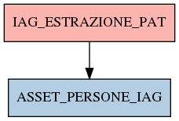

# IAG_ESTRAZIONE_PAT

## Info tabella

| Info                     | Descrizione                                                                                       |
|:-------------------------|:--------------------------------------------------------------------------------------------------|
| Nome tabella Dremio      | IAG_ESTRAZIONE_PAT                                                                                |
| Space Dremio             | fbk_test1__CORE_DATASET                                                                           |
| Nome completo            | fbk_test1__CORE_DATASET.IAG_ESTRAZIONE_PAT                                                        |
| Descrizione tabella      |                                                                                                   |
| Versione                 | 1.0                                                                                               |
| Core dataset             | True                                                                                              |
| Dataset di origine       | IAG                                                                                               |
| Richiede validazione     | True                                                                                              |
| Esposta in DSS           | False                                                                                             |
| Endpoint DSS             |                                                                                                   |
| Query name DSS           |                                                                                                   |
| Formato esposizione      |                                                                                                   |
| Tipologia autenticazione |                                                                                                   |
| Tabelle genitrici        |                                                                                                   |
| Tabelle figlie           | [fbk_test1__MASTER_DATA.ASSET_PERSONE_IAG](/fbk_test1__MASTER_DATA/ASSET_PERSONE_IAG/markdown.md) |

## Struttura relazionale

## Descrizione struttura tabella

| Campo                         | Descrizione                   | Tipo    | Constraints   | Linked data   | errors   |
|:------------------------------|:------------------------------|:--------|:--------------|:--------------|:---------|
| codice_identificativo_igi     | Codice identificativo igi     | string  | {}            |               | {}       |
| nome                          | Nome                          | string  | {}            |               | {}       |
| cognome                       | Cognome                       | string  | {}            |               | {}       |
| codice_fiscale                | Codice fiscale                | string  | {}            |               | {}       |
| data_nascita                  | Data nascita                  | date    | {}            |               | {}       |
| codice_area_contrattuale      | Codice area contrattuale      | integer | {}            |               | {}       |
| descrizione_area_contrattuale | Descrizione area contrattuale | string  | {}            |               | {}       |
| matricola                     | Matricola                     | integer | {}            |               | {}       |
| codice_cittadino              | Codice cittadino              | integer | {}            |               | {}       |
| applicazione                  | Applicazione                  | string  | {}            |               | {}       |
| account                       | Account                       | string  | {}            |               | {}       |
| disabilitato                  | Disabilitato                  | integer | {}            |               | {}       |
| data_disabilitazione          | Data disabilitazione          | date    | {}            |               | {}       |
| permesso                      | Permesso                      | string  | {}            |               | {}       |
| diritto                       | Diritto                       | string  | {}            |               | {}       |
