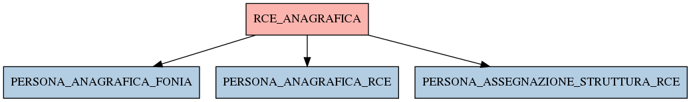

# RCE_ANAGRAFICA

## Info tabella

| Info                     | Descrizione                                                                                                                         |
|:-------------------------|:------------------------------------------------------------------------------------------------------------------------------------|
| Nome tabella Dremio      | RCE_ANAGRAFICA                                                                                                                      |
| Space Dremio             | fbk_test1__CORE_DATASET                                                                                                             |
| Nome completo            | fbk_test1__CORE_DATASET.RCE_ANAGRAFICA                                                                                              |
| Descrizione tabella      |                                                                                                                                     |
| Versione                 | 1.0                                                                                                                                 |
| Core dataset             | True                                                                                                                                |
| Dataset di origine       | RCE                                                                                                                                 |
| Richiede validazione     | True                                                                                                                                |
| Esposta in DSS           | False                                                                                                                               |
| Endpoint DSS             |                                                                                                                                     |
| Query name DSS           |                                                                                                                                     |
| Formato esposizione      |                                                                                                                                     |
| Tipologia autenticazione |                                                                                                                                     |
| Tabelle genitrici        |                                                                                                                                     |
| Tabelle figlie           | [fbk_test1__MASTER_DATA.PERSONA_ANAGRAFICA_FONIA](/fbk_test1__MASTER_DATA/PERSONA_ANAGRAFICA_FONIA/markdown.md)                     |
|                          | [fbk_test1__MASTER_DATA.PERSONA_ANAGRAFICA_RCE](/fbk_test1__MASTER_DATA/PERSONA_ANAGRAFICA_RCE/markdown.md)                         |
|                          | [fbk_test1__MASTER_DATA.PERSONA_ASSEGNAZIONE_STRUTTURA_RCE](/fbk_test1__MASTER_DATA/PERSONA_ASSEGNAZIONE_STRUTTURA_RCE/markdown.md) |

## Struttura relazionale

## Descrizione struttura tabella

| Campo                        | Descrizione                  | Tipo    | Constraints   | Linked data   | errors   |
|:-----------------------------|:-----------------------------|:--------|:--------------|:--------------|:---------|
| matricola                    | Matricola                    | integer | {}            |               | {}       |
| cognome                      | Cognome                      | string  | {}            |               | {}       |
| nome                         | Nome                         | string  | {}            |               | {}       |
| data_nascita                 | Data nascita                 | date    | {}            |               | {}       |
| codice_fiscale               | Codice fiscale               | string  | {}            |               | {}       |
| codice_struttura             | Codice struttura             | string  | {}            |               | {}       |
| descrizione_struttura        | Descrizione struttura        | string  | {}            |               | {}       |
| data_inizio_assegnazione_iag | Data inizio assegnazione iag | date    | {}            |               | {}       |
| data_fine_assegnazione_iag   | Data fine assegnazione iag   | date    | {}            |               | {}       |
