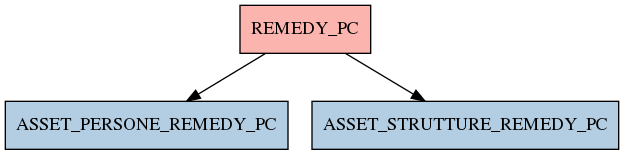

# REMEDY_PC

## Info tabella

| Info                     | Descrizione                                                                                                                     |
|:-------------------------|:--------------------------------------------------------------------------------------------------------------------------------|
| Nome tabella Dremio      | REMEDY_PC                                                                                                                       |
| Space Dremio             | fbk_test1__CORE_DATASET                                                                                                         |
| Nome completo            | fbk_test1__CORE_DATASET.REMEDY_PC                                                                                               |
| Descrizione tabella      |                                                                                                                                 |
| Versione                 | 1.0                                                                                                                             |
| Core dataset             | True                                                                                                                            |
| Dataset di origine       | REMEDY                                                                                                                          |
| Richiede validazione     | True                                                                                                                            |
| Esposta in DSS           | False                                                                                                                           |
| Endpoint DSS             |                                                                                                                                 |
| Query name DSS           |                                                                                                                                 |
| Formato esposizione      |                                                                                                                                 |
| Tipologia autenticazione |                                                                                                                                 |
| Tabelle genitrici        |                                                                                                                                 |
| Tabelle figlie           | [fbk_test1__MASTER_DATA.ASSET_PERSONE_REMEDY_PC](/Documentation/fbk_test1__MASTER_DATA/ASSET_PERSONE_REMEDY_PC/markdown.md)     |
|                          | [fbk_test1__MASTER_DATA.ASSET_STRUTTURE_REMEDY_PC](/Documentation/fbk_test1__MASTER_DATA/ASSET_STRUTTURE_REMEDY_PC/markdown.md) |

## Struttura relazionale

## Descrizione struttura tabella

| Campo                         | Descrizione                   | Tipo   | Constraints   | Linked data   | errors   |
|:------------------------------|:------------------------------|:-------|:--------------|:--------------|:---------|
| pdl_id                        | Pdl id                        | string | {}            |               | {}       |
| aid                           | Aid                           | string | {}            |               | {}       |
| pdl_stato                     | Pdl stato                     | string | {}            |               | {}       |
| pdl_codice_soggetto           | Pdl codice soggetto           | string | {}            |               | {}       |
| pdl_codice_struttura          | Pdl codice struttura          | string | {}            |               | {}       |
| pdl_descrizione_soggetto      | Pdl descrizione soggetto      | string | {}            |               | {}       |
| pdl_descrizione_struttura     | Pdl descrizione struttura     | string | {}            |               | {}       |
| pdl_dipartimento_appartenenza | Pdl dipartimento appartenenza | string | {}            |               | {}       |
| pdl_cap                       | Pdl cap                       | string | {}            |               | {}       |
| pdl_localita                  | Pdl localita                  | string | {}            |               | {}       |
| pdl_indirizzo                 | Pdl indirizzo                 | string | {}            |               | {}       |
| pdl_ubicazione                | Pdl ubicazione                | string | {}            |               | {}       |
| pdl_piano                     | Pdl piano                     | string | {}            |               | {}       |
| pdl_stanza                    | Pdl stanza                    | string | {}            |               | {}       |
| pdl_cognome                   | Pdl cognome                   | string | {}            |               | {}       |
| pdl_nome                      | Pdl nome                      | string | {}            |               | {}       |
| matricola                     | Matricola                     | string | {}            |               | {}       |
| pdl_data_installazione        | Pdl data installazione        | date   | {}            |               | {}       |
| pdl_data_acquisto             | Pdl data acquisto             | date   | {}            |               | {}       |
| pdl_tipo                      | Pdl tipo                      | string | {}            |               | {}       |
| pdl_produttore                | Pdl produttore                | string | {}            |               | {}       |
| pdl_modello                   | Pdl modello                   | string | {}            |               | {}       |
| pdl_proprietario              | Pdl proprietario              | string | {}            |               | {}       |
| pdl_desktop_management        | Pdl desktop management        | string | {}            |               | {}       |
| pdl_fleet                     | Pdl fleet                     | string | {}            |               | {}       |
| pdl_scadenza_fleet            | Pdl scadenza fleet            | string | {}            |               | {}       |
| pdl_sistema_operativo         | Pdl sistema operativo         | string | {}            |               | {}       |
