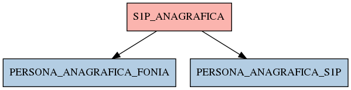

# S1P_ANAGRAFICA

## Info tabella

| Info                     | Descrizione                                                                                                     |
|:-------------------------|:----------------------------------------------------------------------------------------------------------------|
| Nome tabella Dremio      | S1P_ANAGRAFICA                                                                                                  |
| Space Dremio             | fbk_test1__CORE_DATASET                                                                                         |
| Nome completo            | fbk_test1__CORE_DATASET.S1P_ANAGRAFICA                                                                          |
| Descrizione tabella      |                                                                                                                 |
| Versione                 | 1.0                                                                                                             |
| Core dataset             | True                                                                                                            |
| Dataset di origine       | S1P                                                                                                             |
| Richiede validazione     | True                                                                                                            |
| Esposta in DSS           | False                                                                                                           |
| Endpoint DSS             |                                                                                                                 |
| Query name DSS           |                                                                                                                 |
| Formato esposizione      |                                                                                                                 |
| Tipologia autenticazione |                                                                                                                 |
| Tabelle genitrici        |                                                                                                                 |
| Tabelle figlie           | [fbk_test1__MASTER_DATA.PERSONA_ANAGRAFICA_FONIA](/fbk_test1__MASTER_DATA/PERSONA_ANAGRAFICA_FONIA/markdown.md) |
|                          | [fbk_test1__MASTER_DATA.PERSONA_ANAGRAFICA_S1P](/fbk_test1__MASTER_DATA/PERSONA_ANAGRAFICA_S1P/markdown.md)     |

## Struttura relazionale

## Descrizione struttura tabella

| Campo            | Descrizione      | Tipo    | Constraints   | Linked data   | errors   |
|:-----------------|:-----------------|:--------|:--------------|:--------------|:---------|
| codice_ente      | Codice ente      | integer | {}            |               | {}       |
| matricola        | Matricola        | integer | {}            |               | {}       |
| nome             | Nome             | string  | {}            |               | {}       |
| cognome          | Cognome          | string  | {}            |               | {}       |
| data_nascita     | Data nascita     | date    | {}            |               | {}       |
| codice_fiscale   | Codice fiscale   | string  | {}            |               | {}       |
| sesso            | Sesso            | string  | {}            |               | {}       |
| codice_cittadino | Codice cittadino | integer | {}            |               | {}       |
