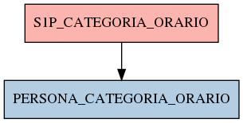

# S1P_CATEGORIA_ORARIO

## Info tabella

| Info                     | Descrizione                                                                                                     |
|:-------------------------|:----------------------------------------------------------------------------------------------------------------|
| Nome tabella Dremio      | S1P_CATEGORIA_ORARIO                                                                                            |
| Space Dremio             | fbk_test1__CORE_DATASET                                                                                         |
| Nome completo            | fbk_test1__CORE_DATASET.S1P_CATEGORIA_ORARIO                                                                    |
| Descrizione tabella      |                                                                                                                 |
| Versione                 | 1.0                                                                                                             |
| Core dataset             | True                                                                                                            |
| Dataset di origine       | S1P                                                                                                             |
| Richiede validazione     | True                                                                                                            |
| Esposta in DSS           | False                                                                                                           |
| Endpoint DSS             |                                                                                                                 |
| Query name DSS           |                                                                                                                 |
| Formato esposizione      |                                                                                                                 |
| Tipologia autenticazione |                                                                                                                 |
| Tabelle genitrici        |                                                                                                                 |
| Tabelle figlie           | [fbk_test1__MASTER_DATA.PERSONA_CATEGORIA_ORARIO](/fbk_test1__MASTER_DATA/PERSONA_CATEGORIA_ORARIO/markdown.md) |

## Struttura relazionale

## Descrizione struttura tabella

| Campo                                     | Descrizione                               | Tipo    | Constraints   | Linked data   | errors   |
|:------------------------------------------|:------------------------------------------|:--------|:--------------|:--------------|:---------|
| codice_ente                               | Codice ente                               | integer | {}            |               | {}       |
| matricola                                 | Matricola                                 | integer | {}            |               | {}       |
| data_inizio_assegnazione_categoria_orario | Data inizio assegnazione categoria orario | date    | {}            |               | {}       |
| data_fine_assegnazione_categoria_orario   | Data fine assegnazione categoria orario   | date    | {}            |               | {}       |
| tipo_assegnazione_orario                  | Tipo assegnazione orario                  | string  | {}            |               | {}       |
| codice_categoria_orario                   | Codice categoria orario                   | string  | {}            |               | {}       |
| data_inserimento_categoria_orario         | Data inserimento categoria orario         | date    | {}            |               | {}       |
| data_applicazione_categoria_orario        | Data applicazione categoria orario        | date    | {}            |               | {}       |
