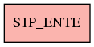

# S1P_ENTE

## Info tabella

| Info                     | Descrizione                      |
|:-------------------------|:---------------------------------|
| Nome tabella Dremio      | S1P_ENTE                         |
| Space Dremio             | fbk_test1__CORE_DATASET          |
| Nome completo            | fbk_test1__CORE_DATASET.S1P_ENTE |
| Descrizione tabella      |                                  |
| Versione                 | 1.0                              |
| Core dataset             | True                             |
| Dataset di origine       | S1P                              |
| Richiede validazione     | True                             |
| Esposta in DSS           | False                            |
| Endpoint DSS             |                                  |
| Query name DSS           |                                  |
| Formato esposizione      |                                  |
| Tipologia autenticazione |                                  |
| Tabelle genitrici        |                                  |
| Tabelle figlie           |                                  |

## Struttura relazionale

## Descrizione struttura tabella

| Campo            | Descrizione      | Tipo    | Constraints   | Linked data   | errors   |
|:-----------------|:-----------------|:--------|:--------------|:--------------|:---------|
| codice_ente      | Codice ente      | integer | {}            |               | {}       |
| descrizione_ente | Descrizione ente | string  | {}            |               | {}       |
