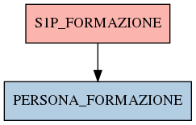

# S1P_FORMAZIONE

## Info tabella

| Info                     | Descrizione                                                                                         |
|:-------------------------|:----------------------------------------------------------------------------------------------------|
| Nome tabella Dremio      | S1P_FORMAZIONE                                                                                      |
| Space Dremio             | fbk_test1__CORE_DATASET                                                                             |
| Nome completo            | fbk_test1__CORE_DATASET.S1P_FORMAZIONE                                                              |
| Descrizione tabella      |                                                                                                     |
| Versione                 | 1.0                                                                                                 |
| Core dataset             | True                                                                                                |
| Dataset di origine       | S1P                                                                                                 |
| Richiede validazione     | True                                                                                                |
| Esposta in DSS           | False                                                                                               |
| Endpoint DSS             |                                                                                                     |
| Query name DSS           |                                                                                                     |
| Formato esposizione      |                                                                                                     |
| Tipologia autenticazione |                                                                                                     |
| Tabelle genitrici        |                                                                                                     |
| Tabelle figlie           | [fbk_test1__MASTER_DATA.PERSONA_FORMAZIONE](/fbk_test1__MASTER_DATA/PERSONA_FORMAZIONE/markdown.md) |

## Struttura relazionale

## Descrizione struttura tabella

| Campo                    | Descrizione              | Tipo    | Constraints   | Linked data   | errors   |
|:-------------------------|:-------------------------|:--------|:--------------|:--------------|:---------|
| codice_ente              | Codice ente              | integer | {}            |               | {}       |
| matricola                | Matricola                | integer | {}            |               | {}       |
| codice_corso             | Codice corso             | string  | {}            |               | {}       |
| descrizione_corso        | Descrizione corso        | string  | {}            |               | {}       |
| ambito_formativo         | Ambito formativo         | string  | {}            |               | {}       |
| quantita_ore_corso       | Quantita ore corso       | number  | {}            |               | {}       |
| data_inizio_formazione   | Data inizio formazione   | date    | {}            |               | {}       |
| data_fine_formazione     | Data fine formazione     | date    | {}            |               | {}       |
| numero_crediti_corso     | Numero crediti corso     | number  | {}            |               | {}       |
| tipologia_corso          | Tipologia corso          | string  | {}            |               | {}       |
| tipologia_partecipazione | Tipologia partecipazione | string  | {}            |               | {}       |
