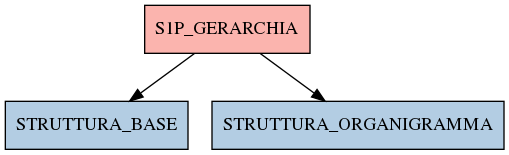

# S1P_GERARCHIA

## Info tabella

| Info                     | Descrizione                                                                                                 |
|:-------------------------|:------------------------------------------------------------------------------------------------------------|
| Nome tabella Dremio      | S1P_GERARCHIA                                                                                               |
| Space Dremio             | fbk_test1__CORE_DATASET                                                                                     |
| Nome completo            | fbk_test1__CORE_DATASET.S1P_GERARCHIA                                                                       |
| Descrizione tabella      |                                                                                                             |
| Versione                 | 1.0                                                                                                         |
| Core dataset             | True                                                                                                        |
| Dataset di origine       | S1P                                                                                                         |
| Richiede validazione     | True                                                                                                        |
| Esposta in DSS           | False                                                                                                       |
| Endpoint DSS             |                                                                                                             |
| Query name DSS           |                                                                                                             |
| Formato esposizione      |                                                                                                             |
| Tipologia autenticazione |                                                                                                             |
| Tabelle genitrici        |                                                                                                             |
| Tabelle figlie           | [fbk_test1__MASTER_DATA.STRUTTURA_BASE](/fbk_test1__MASTER_DATA/STRUTTURA_BASE/markdown.md)                 |
|                          | [fbk_test1__MASTER_DATA.STRUTTURA_ORGANIGRAMMA](/fbk_test1__MASTER_DATA/STRUTTURA_ORGANIGRAMMA/markdown.md) |

## Struttura relazionale

## Descrizione struttura tabella

| Campo                           | Descrizione                     | Tipo    | Constraints   | Linked data   | errors   |
|:--------------------------------|:--------------------------------|:--------|:--------------|:--------------|:---------|
| codice_struttura                | Codice struttura                | string  | {}            |               | {}       |
| tipo_struttura                  | Tipo struttura                  | string  | {}            |               | {}       |
| descrizione_struttura           | Descrizione struttura           | string  | {}            |               | {}       |
| livello_struttura               | Livello struttura               | integer | {}            |               | {}       |
| data_inizio_struttura_calcolata | Data inizio struttura calcolata | date    | {}            |               | {}       |
| data_fine_struttura_calcolata   | Data fine struttura calcolata   | date    | {}            |               | {}       |
| tipo_struttura_superiore        | Tipo struttura superiore        | string  | {}            |               | {}       |
| codice_struttura_superiore      | Codice struttura superiore      | string  | {}            |               | {}       |
| descrizione_struttura_superiore | Descrizione struttura superiore | string  | {}            |               | {}       |
| livello_struttura_superiore     | Livello struttura superiore     | integer | {}            |               | {}       |
| data_inizio_struttura_base      | Data inizio struttura base      | date    | {}            |               | {}       |
| data_fine_struttura_base        | Data fine struttura base        | date    | {}            |               | {}       |
| data_inizio_struttura_superiore | Data inizio struttura superiore | date    | {}            |               | {}       |
| data_fine_struttura_superiore   | Data fine struttura superiore   | date    | {}            |               | {}       |
