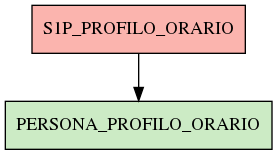

# S1P_PROFILO_ORARIO

## Info tabella

| Info                     | Descrizione                                                                                                                                 |
|:-------------------------|:--------------------------------------------------------------------------------------------------------------------------------------------|
| Nome tabella Dremio      | S1P_PROFILO_ORARIO                                                                                                                          |
| Space Dremio             | fbk_test1__CORE_DATASET                                                                                                                     |
| Nome completo            | fbk_test1__CORE_DATASET.S1P_PROFILO_ORARIO                                                                                                  |
| Descrizione tabella      |                                                                                                                                             |
| Versione                 | 1.0                                                                                                                                         |
| Core dataset             | True                                                                                                                                        |
| Dataset di origine       | S1P                                                                                                                                         |
| Richiede validazione     | True                                                                                                                                        |
| Esposta in DSS           | False                                                                                                                                       |
| Endpoint DSS             |                                                                                                                                             |
| Query name DSS           |                                                                                                                                             |
| Formato esposizione      |                                                                                                                                             |
| Tipologia autenticazione |                                                                                                                                             |
| Tabelle genitrici        |                                                                                                                                             |
| Tabelle figlie           | [fbk_test1__VISUALIZATION_TABLES.PERSONA_PROFILO_ORARIO](/Documentation/fbk_test1__VISUALIZATION_TABLES/PERSONA_PROFILO_ORARIO/markdown.md) |

## Struttura relazionale

## Descrizione struttura tabella

| Campo                      | Descrizione                | Tipo    | Constraints   | Linked data   | errors   |
|:---------------------------|:---------------------------|:--------|:--------------|:--------------|:---------|
| codice_categoria_orario    | Codice categoria orario    | string  | {}            |               | {}       |
| descrizione_profilo_orario | Descrizione profilo orario | string  | {}            |               | {}       |
| c_numcicl                  | C numcicl                  | integer | {}            |               | {}       |
| codice_profilo_orario      | Codice profilo orario      | string  | {}            |               | {}       |
| ora_inizio_fascia          | Ora inizio fascia          | time    | {}            |               | {}       |
| ora_fine_fascia            | Ora fine fascia            | time    | {}            |               | {}       |
| flessibilita_obbligatoria  | Flessibilita obbligatoria  | string  | {}            |               | {}       |
