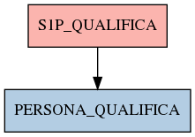

# S1P_QUALIFICA

## Info tabella

| Info                     | Descrizione                                                                                       |
|:-------------------------|:--------------------------------------------------------------------------------------------------|
| Nome tabella Dremio      | S1P_QUALIFICA                                                                                     |
| Space Dremio             | fbk_test1__CORE_DATASET                                                                           |
| Nome completo            | fbk_test1__CORE_DATASET.S1P_QUALIFICA                                                             |
| Descrizione tabella      |                                                                                                   |
| Versione                 | 1.0                                                                                               |
| Core dataset             | True                                                                                              |
| Dataset di origine       | S1P                                                                                               |
| Richiede validazione     | True                                                                                              |
| Esposta in DSS           | False                                                                                             |
| Endpoint DSS             |                                                                                                   |
| Query name DSS           |                                                                                                   |
| Formato esposizione      |                                                                                                   |
| Tipologia autenticazione |                                                                                                   |
| Tabelle genitrici        |                                                                                                   |
| Tabelle figlie           | [fbk_test1__MASTER_DATA.PERSONA_QUALIFICA](/fbk_test1__MASTER_DATA/PERSONA_QUALIFICA/markdown.md) |

## Struttura relazionale

## Descrizione struttura tabella

| Campo                         | Descrizione                   | Tipo    | Constraints   | Linked data   | errors   |
|:------------------------------|:------------------------------|:--------|:--------------|:--------------|:---------|
| codice_ente                   | Codice ente                   | integer | {}            |               | {}       |
| matricola                     | Matricola                     | integer | {}            |               | {}       |
| data_inizio_qualifica         | Data inizio qualifica         | date    | {}            |               | {}       |
| data_fine_qualifica           | Data fine qualifica           | date    | {}            |               | {}       |
| codice_qualifica              | Codice qualifica              | string  | {}            |               | {}       |
| descrizione_qualifica         | Descrizione qualifica         | string  | {}            |               | {}       |
| codice_livello_giuridico      | Codice livello giuridico      | string  | {}            |               | {}       |
| descrizione_livello_giuridico | Descrizione livello giuridico | string  | {}            |               | {}       |
| data_inserimento_qualifica    | Data inserimento qualifica    | date    | {}            |               | {}       |
| data_applicazione_qualifica   | Data applicazione qualifica   | date    | {}            |               | {}       |
