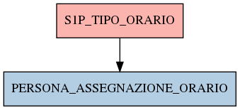

# S1P_TIPO_ORARIO

## Info tabella

| Info                     | Descrizione                                                                                                                         |
|:-------------------------|:------------------------------------------------------------------------------------------------------------------------------------|
| Nome tabella Dremio      | S1P_TIPO_ORARIO                                                                                                                     |
| Space Dremio             | fbk_test1__CORE_DATASET                                                                                                             |
| Nome completo            | fbk_test1__CORE_DATASET.S1P_TIPO_ORARIO                                                                                             |
| Descrizione tabella      |                                                                                                                                     |
| Versione                 | 1.0                                                                                                                                 |
| Core dataset             | True                                                                                                                                |
| Dataset di origine       | S1P                                                                                                                                 |
| Richiede validazione     | True                                                                                                                                |
| Esposta in DSS           | False                                                                                                                               |
| Endpoint DSS             |                                                                                                                                     |
| Query name DSS           |                                                                                                                                     |
| Formato esposizione      |                                                                                                                                     |
| Tipologia autenticazione |                                                                                                                                     |
| Tabelle genitrici        |                                                                                                                                     |
| Tabelle figlie           | [fbk_test1__MASTER_DATA.PERSONA_ASSEGNAZIONE_ORARIO](/Documentation/fbk_test1__MASTER_DATA/PERSONA_ASSEGNAZIONE_ORARIO/markdown.md) |

## Struttura relazionale

## Descrizione struttura tabella

| Campo                   | Descrizione             | Tipo    | Constraints   | Linked data   | errors   |
|:------------------------|:------------------------|:--------|:--------------|:--------------|:---------|
| codice_orario           | Codice orario           | integer | {}            |               | {}       |
| descrizione_tipo_orario | Descrizione tipo orario | string  | {}            |               | {}       |
| data_inizio_tipo_orario | Data inizio tipo orario | date    | {}            |               | {}       |
| data_fine_tipo_orario   | Data fine tipo orario   | date    | {}            |               | {}       |
