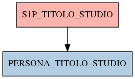

# S1P_TITOLO_STUDIO

## Info tabella

| Info                     | Descrizione                                                                                                             |
|:-------------------------|:------------------------------------------------------------------------------------------------------------------------|
| Nome tabella Dremio      | S1P_TITOLO_STUDIO                                                                                                       |
| Space Dremio             | fbk_test1__CORE_DATASET                                                                                                 |
| Nome completo            | fbk_test1__CORE_DATASET.S1P_TITOLO_STUDIO                                                                               |
| Descrizione tabella      |                                                                                                                         |
| Versione                 | 1.0                                                                                                                     |
| Core dataset             | True                                                                                                                    |
| Dataset di origine       | S1P                                                                                                                     |
| Richiede validazione     | True                                                                                                                    |
| Esposta in DSS           | False                                                                                                                   |
| Endpoint DSS             |                                                                                                                         |
| Query name DSS           |                                                                                                                         |
| Formato esposizione      |                                                                                                                         |
| Tipologia autenticazione |                                                                                                                         |
| Tabelle genitrici        |                                                                                                                         |
| Tabelle figlie           | [fbk_test1__MASTER_DATA.PERSONA_TITOLO_STUDIO](/Documentation/fbk_test1__MASTER_DATA/PERSONA_TITOLO_STUDIO/markdown.md) |

## Struttura relazionale

## Descrizione struttura tabella

| Campo                     | Descrizione               | Tipo    | Constraints   | Linked data   | errors   |
|:--------------------------|:--------------------------|:--------|:--------------|:--------------|:---------|
| codice_ente               | Codice ente               | integer | {}            |               | {}       |
| matricola                 | Matricola                 | integer | {}            |               | {}       |
| data_inizio_titolo_studio | Data inizio titolo studio | date    | {}            |               | {}       |
| codice_titolo_studio      | Codice titolo studio      | string  | {}            |               | {}       |
| descrizione_titolo_studio | Descrizione titolo studio | string  | {}            |               | {}       |
