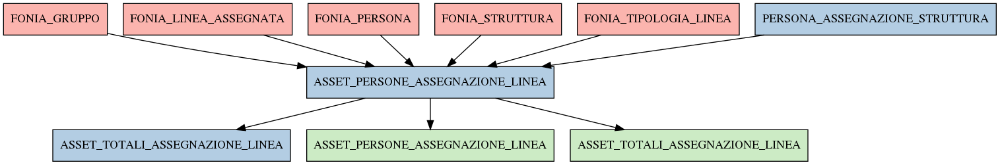

# ASSET_PERSONE_ASSEGNAZIONE_LINEA

## Info tabella

| Info                     | Descrizione                                                                                                                                                     |
|:-------------------------|:----------------------------------------------------------------------------------------------------------------------------------------------------------------|
| Nome tabella Dremio      | ASSET_PERSONE_ASSEGNAZIONE_LINEA                                                                                                                                |
| Space Dremio             | fbk_test1__MASTER_DATA                                                                                                                                          |
| Nome completo            | fbk_test1__MASTER_DATA.ASSET_PERSONE_ASSEGNAZIONE_LINEA                                                                                                         |
| Descrizione tabella      |                                                                                                                                                                 |
| Versione                 | 1.0                                                                                                                                                             |
| Core dataset             | False                                                                                                                                                           |
| Dataset di origine       |                                                                                                                                                                 |
| Richiede validazione     | True                                                                                                                                                            |
| Esposta in DSS           | False                                                                                                                                                           |
| Endpoint DSS             |                                                                                                                                                                 |
| Query name DSS           |                                                                                                                                                                 |
| Formato esposizione      |                                                                                                                                                                 |
| Tipologia autenticazione |                                                                                                                                                                 |
| Tabelle genitrici        | [fbk_test1__CORE_DATASET.FONIA_GRUPPO](/Documentation/fbk_test1__CORE_DATASET/FONIA_GRUPPO/markdown.md)                                                         |
|                          | [fbk_test1__CORE_DATASET.FONIA_LINEA_ASSEGNATA](/Documentation/fbk_test1__CORE_DATASET/FONIA_LINEA_ASSEGNATA/markdown.md)                                       |
|                          | [fbk_test1__CORE_DATASET.FONIA_PERSONA](/Documentation/fbk_test1__CORE_DATASET/FONIA_PERSONA/markdown.md)                                                       |
|                          | [fbk_test1__CORE_DATASET.FONIA_STRUTTURA](/Documentation/fbk_test1__CORE_DATASET/FONIA_STRUTTURA/markdown.md)                                                   |
|                          | [fbk_test1__CORE_DATASET.FONIA_TIPOLOGIA_LINEA](/Documentation/fbk_test1__CORE_DATASET/FONIA_TIPOLOGIA_LINEA/markdown.md)                                       |
|                          | [fbk_test1__MASTER_DATA.PERSONA_ASSEGNAZIONE_STRUTTURA](/Documentation/fbk_test1__MASTER_DATA/PERSONA_ASSEGNAZIONE_STRUTTURA/markdown.md)                       |
| Tabelle figlie           | [fbk_test1__MASTER_DATA.ASSET_TOTALI_ASSEGNAZIONE_LINEA](/Documentation/fbk_test1__MASTER_DATA/ASSET_TOTALI_ASSEGNAZIONE_LINEA/markdown.md)                     |
|                          | [fbk_test1__VISUALIZATION_TABLES.ASSET_PERSONE_ASSEGNAZIONE_LINEA](/Documentation/fbk_test1__VISUALIZATION_TABLES/ASSET_PERSONE_ASSEGNAZIONE_LINEA/markdown.md) |
|                          | [fbk_test1__VISUALIZATION_TABLES.ASSET_TOTALI_ASSEGNAZIONE_LINEA](/Documentation/fbk_test1__VISUALIZATION_TABLES/ASSET_TOTALI_ASSEGNAZIONE_LINEA/markdown.md)   |

## Struttura relazionale

## Descrizione struttura tabella

| Campo                          | Descrizione                    | Tipo    | Constraints   | Linked data   | errors   |
|:-------------------------------|:-------------------------------|:--------|:--------------|:--------------|:---------|
| id_assegnazione_linea          | Id assegnazione linea          | integer | {}            |               | {}       |
| data_fine_assegnazione_linea   | Data fine assegnazione linea   | date    | {}            |               | {}       |
| data_inizio_assegnazione_linea | Data inizio assegnazione linea | date    | {}            |               | {}       |
| linea_is_personale             | Linea is personale             | integer | {}            |               | {}       |
| causale_ritiro                 | Causale ritiro                 | string  | {}            |               | {}       |
| linea_id                       | Linea id                       | integer | {}            |               | {}       |
| matricola_estesa               | Matricola estesa               | string  | {}            |               | {}       |
| matricola                      | Matricola                      | integer | {}            |               | {}       |
| codice_fiscale                 | Codice fiscale                 | string  | {}            |               | {}       |
| codice_struttura_fonia         | Codice struttura fonia         | string  | {}            |               | {}       |
| descrizione_gruppo             | Descrizione gruppo             | string  | {}            |               | {}       |
| descrizione_tipologia_linea    | Descrizione tipologia linea    | string  | {}            |               | {}       |
| id_struttura                   | Id struttura                   | integer | {}            |               | {}       |
