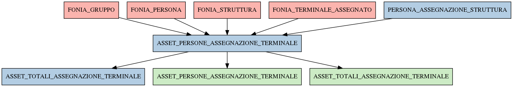

# ASSET_PERSONE_ASSEGNAZIONE_TERMINALE

## Info tabella

| Info                     | Descrizione                                                                                                                                               |
|:-------------------------|:----------------------------------------------------------------------------------------------------------------------------------------------------------|
| Nome tabella Dremio      | ASSET_PERSONE_ASSEGNAZIONE_TERMINALE                                                                                                                      |
| Space Dremio             | fbk_test1__MASTER_DATA                                                                                                                                    |
| Nome completo            | fbk_test1__MASTER_DATA.ASSET_PERSONE_ASSEGNAZIONE_TERMINALE                                                                                               |
| Descrizione tabella      |                                                                                                                                                           |
| Versione                 | 1.0                                                                                                                                                       |
| Core dataset             | False                                                                                                                                                     |
| Dataset di origine       |                                                                                                                                                           |
| Richiede validazione     | False                                                                                                                                                     |
| Esposta in DSS           | False                                                                                                                                                     |
| Endpoint DSS             |                                                                                                                                                           |
| Query name DSS           |                                                                                                                                                           |
| Formato esposizione      |                                                                                                                                                           |
| Tipologia autenticazione |                                                                                                                                                           |
| Tabelle genitrici        | [fbk_test1__CORE_DATASET.FONIA_GRUPPO](/fbk_test1__CORE_DATASET/FONIA_GRUPPO/markdown.md)                                                                 |
|                          | [fbk_test1__CORE_DATASET.FONIA_PERSONA](/fbk_test1__CORE_DATASET/FONIA_PERSONA/markdown.md)                                                               |
|                          | [fbk_test1__CORE_DATASET.FONIA_STRUTTURA](/fbk_test1__CORE_DATASET/FONIA_STRUTTURA/markdown.md)                                                           |
|                          | [fbk_test1__CORE_DATASET.FONIA_TERMINALE_ASSEGNATO](/fbk_test1__CORE_DATASET/FONIA_TERMINALE_ASSEGNATO/markdown.md)                                       |
|                          | [fbk_test1__MASTER_DATA.PERSONA_ASSEGNAZIONE_STRUTTURA](/fbk_test1__MASTER_DATA/PERSONA_ASSEGNAZIONE_STRUTTURA/markdown.md)                               |
| Tabelle figlie           | [fbk_test1__MASTER_DATA.ASSET_TOTALI_ASSEGNAZIONE_TERMINALE](/fbk_test1__MASTER_DATA/ASSET_TOTALI_ASSEGNAZIONE_TERMINALE/markdown.md)                     |
|                          | [fbk_test1__VISUALIZATION_TABLES.ASSET_PERSONE_ASSEGNAZIONE_TERMINALE](/fbk_test1__VISUALIZATION_TABLES/ASSET_PERSONE_ASSEGNAZIONE_TERMINALE/markdown.md) |
|                          | [fbk_test1__VISUALIZATION_TABLES.ASSET_TOTALI_ASSEGNAZIONE_TERMINALE](/fbk_test1__VISUALIZATION_TABLES/ASSET_TOTALI_ASSEGNAZIONE_TERMINALE/markdown.md)   |

## Struttura relazionale

## Descrizione struttura tabella

| Campo                              | Descrizione                        | Tipo    | Constraints   | Linked data   | errors   |
|:-----------------------------------|:-----------------------------------|:--------|:--------------|:--------------|:---------|
| id_assegnazione_terminale          | Id assegnazione terminale          | integer | {}            |               | {}       |
| data_fine_assegnazione_terminale   | Data fine assegnazione terminale   | date    | {}            |               | {}       |
| data_inizio_assegnazione_terminale | Data inizio assegnazione terminale | date    | {}            |               | {}       |
| terminale_is_personale             | Terminale is personale             | integer | {}            |               | {}       |
| causale_ritiro_terminale           | Causale ritiro terminale           | string  | {}            |               | {}       |
| terminale_id                       | Terminale id                       | integer | {}            |               | {}       |
| matricola_estesa                   | Matricola estesa                   | string  | {}            |               | {}       |
| matricola                          | Matricola                          | integer | {}            |               | {}       |
| codice_fiscale                     | Codice fiscale                     | string  | {}            |               | {}       |
| codice_struttura_fonia             | Codice struttura fonia             | string  | {}            |               | {}       |
| descrizione_gruppo                 | Descrizione gruppo                 | string  | {}            |               | {}       |
| id_struttura                       | Id struttura                       | integer | {}            |               | {}       |
