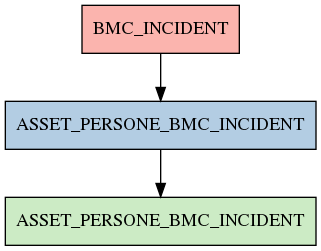

# ASSET_PERSONE_BMC_INCIDENT

## Info tabella

| Info                     | Descrizione                                                                                                                           |
|:-------------------------|:--------------------------------------------------------------------------------------------------------------------------------------|
| Nome tabella Dremio      | ASSET_PERSONE_BMC_INCIDENT                                                                                                            |
| Space Dremio             | fbk_test1__MASTER_DATA                                                                                                                |
| Nome completo            | fbk_test1__MASTER_DATA.ASSET_PERSONE_BMC_INCIDENT                                                                                     |
| Descrizione tabella      |                                                                                                                                       |
| Versione                 | 1.0                                                                                                                                   |
| Core dataset             | False                                                                                                                                 |
| Dataset di origine       |                                                                                                                                       |
| Richiede validazione     | False                                                                                                                                 |
| Esposta in DSS           | False                                                                                                                                 |
| Endpoint DSS             |                                                                                                                                       |
| Query name DSS           |                                                                                                                                       |
| Formato esposizione      |                                                                                                                                       |
| Tipologia autenticazione |                                                                                                                                       |
| Tabelle genitrici        | [fbk_test1__CORE_DATASET.BMC_INCIDENT](/fbk_test1__CORE_DATASET/BMC_INCIDENT/markdown.md)                                             |
| Tabelle figlie           | [fbk_test1__VISUALIZATION_TABLES.ASSET_PERSONE_BMC_INCIDENT](/fbk_test1__VISUALIZATION_TABLES/ASSET_PERSONE_BMC_INCIDENT/markdown.md) |

## Struttura relazionale

## Descrizione struttura tabella

| Campo                           | Descrizione                     | Tipo     | Constraints   | Linked data   | errors   |
|:--------------------------------|:--------------------------------|:---------|:--------------|:--------------|:---------|
| bmc_incident                    | Bmc incident                    | string   | {}            |               | {}       |
| bmc_company                     | Bmc company                     | string   | {}            |               | {}       |
| bmc_direct_contact_organization | Bmc direct contact organization | string   | {}            |               | {}       |
| bmc_direct_contact_departement  | Bmc direct contact departement  | string   | {}            |               | {}       |
| bmc_nome                        | Bmc nome                        | string   | {}            |               | {}       |
| bmc_cognome                     | Bmc cognome                     | string   | {}            |               | {}       |
| bmc_servizio                    | Bmc servizio                    | string   | {}            |               | {}       |
| bmc_status                      | Bmc status                      | string   | {}            |               | {}       |
| bmc_data_submission             | Bmc data submission             | datetime | {}            |               | {}       |
| bmc_data_risoluzione            | Bmc data risoluzione            | datetime | {}            |               | {}       |
| bmc_sommario                    | Bmc sommario                    | string   | {}            |               | {}       |
| bmc_note                        | Bmc note                        | string   | {}            |               | {}       |
| bmc_risoluzione                 | Bmc risoluzione                 | string   | {}            |               | {}       |
| matricola_estesa                | Matricola estesa                | string   | {}            |               | {}       |
