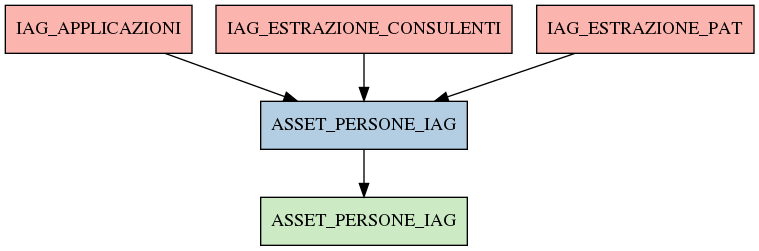

# ASSET_PERSONE_IAG

## Info tabella

| Info                     | Descrizione                                                                                                         |
|:-------------------------|:--------------------------------------------------------------------------------------------------------------------|
| Nome tabella Dremio      | ASSET_PERSONE_IAG                                                                                                   |
| Space Dremio             | fbk_test1__MASTER_DATA                                                                                              |
| Nome completo            | fbk_test1__MASTER_DATA.ASSET_PERSONE_IAG                                                                            |
| Descrizione tabella      |                                                                                                                     |
| Versione                 | 1.0                                                                                                                 |
| Core dataset             | False                                                                                                               |
| Dataset di origine       |                                                                                                                     |
| Richiede validazione     | False                                                                                                               |
| Esposta in DSS           | False                                                                                                               |
| Endpoint DSS             |                                                                                                                     |
| Query name DSS           |                                                                                                                     |
| Formato esposizione      |                                                                                                                     |
| Tipologia autenticazione |                                                                                                                     |
| Tabelle genitrici        | [fbk_test1__CORE_DATASET.IAG_APPLICAZIONI](/fbk_test1__CORE_DATASET/IAG_APPLICAZIONI/markdown.md)                   |
|                          | [fbk_test1__CORE_DATASET.IAG_ESTRAZIONE_CONSULENTI](/fbk_test1__CORE_DATASET/IAG_ESTRAZIONE_CONSULENTI/markdown.md) |
|                          | [fbk_test1__CORE_DATASET.IAG_ESTRAZIONE_PAT](/fbk_test1__CORE_DATASET/IAG_ESTRAZIONE_PAT/markdown.md)               |
| Tabelle figlie           | [fbk_test1__VISUALIZATION_TABLES.ASSET_PERSONE_IAG](/fbk_test1__VISUALIZATION_TABLES/ASSET_PERSONE_IAG/markdown.md) |

## Struttura relazionale

## Descrizione struttura tabella

| Campo                         | Descrizione                   | Tipo    | Constraints   | Linked data   | errors   |
|:------------------------------|:------------------------------|:--------|:--------------|:--------------|:---------|
| codice_identificativo_igi     | Codice identificativo igi     | string  | {}            |               | {}       |
| nome                          | Nome                          | string  | {}            |               | {}       |
| cognome                       | Cognome                       | string  | {}            |               | {}       |
| codice_fiscale                | Codice fiscale                | string  | {}            |               | {}       |
| data_nascita                  | Data nascita                  | date    | {}            |               | {}       |
| codice_area_contrattuale      | Codice area contrattuale      | integer | {}            |               | {}       |
| descrizione_area_contrattuale | Descrizione area contrattuale | string  | {}            |               | {}       |
| matricola                     | Matricola                     | integer | {}            |               | {}       |
| codice_cittadino              | Codice cittadino              | integer | {}            |               | {}       |
| applicazione                  | Applicazione                  | string  | {}            |               | {}       |
| account                       | Account                       | string  | {}            |               | {}       |
| disabilitato                  | Disabilitato                  | integer | {}            |               | {}       |
| data_disabilitazione          | Data disabilitazione          | date    | {}            |               | {}       |
| permesso                      | Permesso                      | string  | {}            |               | {}       |
| diritto                       | Diritto                       | string  | {}            |               | {}       |
| matricola_estesa              | Matricola estesa              | string  | {}            |               | {}       |
| codice_applicazione           | Codice applicazione           | string  | {}            |               | {}       |
| descrizione_applicazione      | Descrizione applicazione      | string  | {}            |               | {}       |
| tipologia_account             | Tipologia account             | string  | {}            |               | {}       |
| profilo                       | Profilo                       | string  | {}            |               | {}       |
| gestione                      | Gestione                      | string  | {}            |               | {}       |
