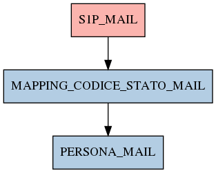

# MAPPING_CODICE_STATO_MAIL

## Info tabella

| Info                     | Descrizione                                                                                           |
|:-------------------------|:------------------------------------------------------------------------------------------------------|
| Nome tabella Dremio      | MAPPING_CODICE_STATO_MAIL                                                                             |
| Space Dremio             | fbk_test1__MASTER_DATA                                                                                |
| Nome completo            | fbk_test1__MASTER_DATA.MAPPING_CODICE_STATO_MAIL                                                      |
| Descrizione tabella      |                                                                                                       |
| Versione                 | 1.0                                                                                                   |
| Core dataset             | False                                                                                                 |
| Dataset di origine       |                                                                                                       |
| Richiede validazione     | True                                                                                                  |
| Esposta in DSS           | False                                                                                                 |
| Endpoint DSS             |                                                                                                       |
| Query name DSS           |                                                                                                       |
| Formato esposizione      |                                                                                                       |
| Tipologia autenticazione |                                                                                                       |
| Tabelle genitrici        | [fbk_test1__CORE_DATASET.S1P_MAIL](/Documentation/fbk_test1__CORE_DATASET/S1P_MAIL/markdown.md)       |
| Tabelle figlie           | [fbk_test1__MASTER_DATA.PERSONA_MAIL](/Documentation/fbk_test1__MASTER_DATA/PERSONA_MAIL/markdown.md) |

## Struttura relazionale

## Descrizione struttura tabella

| Campo                  | Descrizione            | Tipo   | Constraints   | Linked data   | errors   |
|:-----------------------|:-----------------------|:-------|:--------------|:--------------|:---------|
| codice_stato_mail      | Codice stato mail      | string | {}            |               | {}       |
| descrizione_stato_mail | Descrizione stato mail | string | {}            |               | {}       |
