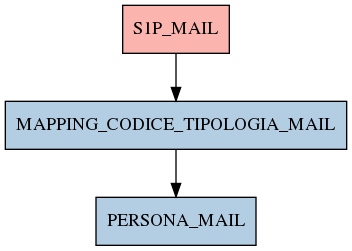

# MAPPING_CODICE_TIPOLOGIA_MAIL

## Info tabella

| Info                     | Descrizione                                                                             |
|:-------------------------|:----------------------------------------------------------------------------------------|
| Nome tabella Dremio      | MAPPING_CODICE_TIPOLOGIA_MAIL                                                           |
| Space Dremio             | fbk_test1__MASTER_DATA                                                                  |
| Nome completo            | fbk_test1__MASTER_DATA.MAPPING_CODICE_TIPOLOGIA_MAIL                                    |
| Descrizione tabella      |                                                                                         |
| Versione                 | 1.0                                                                                     |
| Core dataset             | False                                                                                   |
| Dataset di origine       |                                                                                         |
| Richiede validazione     | False                                                                                   |
| Esposta in DSS           | False                                                                                   |
| Endpoint DSS             |                                                                                         |
| Query name DSS           |                                                                                         |
| Formato esposizione      |                                                                                         |
| Tipologia autenticazione |                                                                                         |
| Tabelle genitrici        | [fbk_test1__CORE_DATASET.S1P_MAIL](/fbk_test1__CORE_DATASET/S1P_MAIL/markdown.md)       |
| Tabelle figlie           | [fbk_test1__MASTER_DATA.PERSONA_MAIL](/fbk_test1__MASTER_DATA/PERSONA_MAIL/markdown.md) |

## Struttura relazionale

## Descrizione struttura tabella

| Campo                      | Descrizione                | Tipo   | Constraints   | Linked data   | errors   |
|:---------------------------|:---------------------------|:-------|:--------------|:--------------|:---------|
| codice_tipologia_mail      | Codice tipologia mail      | string | {}            |               | {}       |
| descrizione_tipologia_mail | Descrizione tipologia mail | string | {}            |               | {}       |
