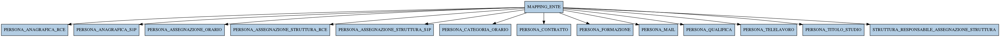

# MAPPING_ENTE

## Info tabella

| Info                     | Descrizione                                                                                                                                               |
|:-------------------------|:----------------------------------------------------------------------------------------------------------------------------------------------------------|
| Nome tabella Dremio      | MAPPING_ENTE                                                                                                                                              |
| Space Dremio             | fbk_test1__MASTER_DATA                                                                                                                                    |
| Nome completo            | fbk_test1__MASTER_DATA.MAPPING_ENTE                                                                                                                       |
| Descrizione tabella      |                                                                                                                                                           |
| Versione                 | 1.0                                                                                                                                                       |
| Core dataset             | False                                                                                                                                                     |
| Dataset di origine       |                                                                                                                                                           |
| Richiede validazione     | False                                                                                                                                                     |
| Esposta in DSS           | False                                                                                                                                                     |
| Endpoint DSS             |                                                                                                                                                           |
| Query name DSS           |                                                                                                                                                           |
| Formato esposizione      |                                                                                                                                                           |
| Tipologia autenticazione |                                                                                                                                                           |
| Tabelle genitrici        |                                                                                                                                                           |
| Tabelle figlie           | [fbk_test1__MASTER_DATA.PERSONA_ANAGRAFICA_RCE](/fbk_test1__MASTER_DATA/PERSONA_ANAGRAFICA_RCE/markdown.md)                                               |
|                          | [fbk_test1__MASTER_DATA.PERSONA_ANAGRAFICA_S1P](/fbk_test1__MASTER_DATA/PERSONA_ANAGRAFICA_S1P/markdown.md)                                               |
|                          | [fbk_test1__MASTER_DATA.PERSONA_ASSEGNAZIONE_ORARIO](/fbk_test1__MASTER_DATA/PERSONA_ASSEGNAZIONE_ORARIO/markdown.md)                                     |
|                          | [fbk_test1__MASTER_DATA.PERSONA_ASSEGNAZIONE_STRUTTURA_RCE](/fbk_test1__MASTER_DATA/PERSONA_ASSEGNAZIONE_STRUTTURA_RCE/markdown.md)                       |
|                          | [fbk_test1__MASTER_DATA.PERSONA_ASSEGNAZIONE_STRUTTURA_S1P](/fbk_test1__MASTER_DATA/PERSONA_ASSEGNAZIONE_STRUTTURA_S1P/markdown.md)                       |
|                          | [fbk_test1__MASTER_DATA.PERSONA_CATEGORIA_ORARIO](/fbk_test1__MASTER_DATA/PERSONA_CATEGORIA_ORARIO/markdown.md)                                           |
|                          | [fbk_test1__MASTER_DATA.PERSONA_CONTRATTO](/fbk_test1__MASTER_DATA/PERSONA_CONTRATTO/markdown.md)                                                         |
|                          | [fbk_test1__MASTER_DATA.PERSONA_FORMAZIONE](/fbk_test1__MASTER_DATA/PERSONA_FORMAZIONE/markdown.md)                                                       |
|                          | [fbk_test1__MASTER_DATA.PERSONA_MAIL](/fbk_test1__MASTER_DATA/PERSONA_MAIL/markdown.md)                                                                   |
|                          | [fbk_test1__MASTER_DATA.PERSONA_QUALIFICA](/fbk_test1__MASTER_DATA/PERSONA_QUALIFICA/markdown.md)                                                         |
|                          | [fbk_test1__MASTER_DATA.PERSONA_TELELAVORO](/fbk_test1__MASTER_DATA/PERSONA_TELELAVORO/markdown.md)                                                       |
|                          | [fbk_test1__MASTER_DATA.PERSONA_TITOLO_STUDIO](/fbk_test1__MASTER_DATA/PERSONA_TITOLO_STUDIO/markdown.md)                                                 |
|                          | [fbk_test1__MASTER_DATA.STRUTTURA_RESPONSABILE_ASSEGNAZIONE_STRUTTURA](/fbk_test1__MASTER_DATA/STRUTTURA_RESPONSABILE_ASSEGNAZIONE_STRUTTURA/markdown.md) |

## Struttura relazionale

## Descrizione struttura tabella

| Campo              | Descrizione        | Tipo    | Constraints   | Linked data   | errors   |
|:-------------------|:-------------------|:--------|:--------------|:--------------|:---------|
| codice_ente        | Codice ente        | integer | {}            |               | {}       |
| prefisso_matricola | Prefisso matricola | string  | {}            |               | {}       |
