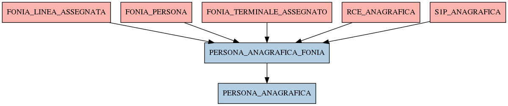

# PERSONA_ANAGRAFICA_FONIA

## Info tabella

| Info                     | Descrizione                                                                                                         |
|:-------------------------|:--------------------------------------------------------------------------------------------------------------------|
| Nome tabella Dremio      | PERSONA_ANAGRAFICA_FONIA                                                                                            |
| Space Dremio             | fbk_test1__MASTER_DATA                                                                                              |
| Nome completo            | fbk_test1__MASTER_DATA.PERSONA_ANAGRAFICA_FONIA                                                                     |
| Descrizione tabella      |                                                                                                                     |
| Versione                 | 1.0                                                                                                                 |
| Core dataset             | False                                                                                                               |
| Dataset di origine       |                                                                                                                     |
| Richiede validazione     | False                                                                                                               |
| Esposta in DSS           | False                                                                                                               |
| Endpoint DSS             |                                                                                                                     |
| Query name DSS           |                                                                                                                     |
| Formato esposizione      |                                                                                                                     |
| Tipologia autenticazione |                                                                                                                     |
| Tabelle genitrici        | [fbk_test1__CORE_DATASET.FONIA_LINEA_ASSEGNATA](/fbk_test1__CORE_DATASET/FONIA_LINEA_ASSEGNATA/markdown.md)         |
|                          | [fbk_test1__CORE_DATASET.FONIA_PERSONA](/fbk_test1__CORE_DATASET/FONIA_PERSONA/markdown.md)                         |
|                          | [fbk_test1__CORE_DATASET.FONIA_TERMINALE_ASSEGNATO](/fbk_test1__CORE_DATASET/FONIA_TERMINALE_ASSEGNATO/markdown.md) |
|                          | [fbk_test1__CORE_DATASET.RCE_ANAGRAFICA](/fbk_test1__CORE_DATASET/RCE_ANAGRAFICA/markdown.md)                       |
|                          | [fbk_test1__CORE_DATASET.S1P_ANAGRAFICA](/fbk_test1__CORE_DATASET/S1P_ANAGRAFICA/markdown.md)                       |
| Tabelle figlie           | [fbk_test1__MASTER_DATA.PERSONA_ANAGRAFICA](/fbk_test1__MASTER_DATA/PERSONA_ANAGRAFICA/markdown.md)                 |

## Struttura relazionale

## Descrizione struttura tabella

| Campo            | Descrizione      | Tipo    | Constraints   | Linked data   | errors   |
|:-----------------|:-----------------|:--------|:--------------|:--------------|:---------|
| matricola_estesa | Matricola estesa | string  | {}            |               | {}       |
| matricola        | Matricola        | integer | {}            |               | {}       |
| nome             | Nome             | string  | {}            |               | {}       |
| cognome          | Cognome          | string  | {}            |               | {}       |
| data_nascita     | Data nascita     | date    | {}            |               | {}       |
| codice_fiscale   | Codice fiscale   | string  | {}            |               | {}       |
| sesso            | Sesso            | string  | {}            |               | {}       |
| codice_cittadino | Codice cittadino | integer | {}            |               | {}       |
| provenienza      | Provenienza      | string  | {}            |               | {}       |
