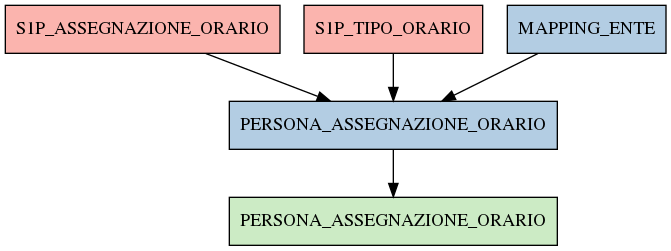

# PERSONA_ASSEGNAZIONE_ORARIO

## Info tabella

| Info                     | Descrizione                                                                                                                             |
|:-------------------------|:----------------------------------------------------------------------------------------------------------------------------------------|
| Nome tabella Dremio      | PERSONA_ASSEGNAZIONE_ORARIO                                                                                                             |
| Space Dremio             | fbk_test1__MASTER_DATA                                                                                                                  |
| Nome completo            | fbk_test1__MASTER_DATA.PERSONA_ASSEGNAZIONE_ORARIO                                                                                      |
| Descrizione tabella      |                                                                                                                                         |
| Versione                 | 1.0                                                                                                                                     |
| Core dataset             | False                                                                                                                                   |
| Dataset di origine       |                                                                                                                                         |
| Richiede validazione     | False                                                                                                                                   |
| Esposta in DSS           | False                                                                                                                                   |
| Endpoint DSS             |                                                                                                                                         |
| Query name DSS           |                                                                                                                                         |
| Formato esposizione      |                                                                                                                                         |
| Tipologia autenticazione |                                                                                                                                         |
| Tabelle genitrici        | [fbk_test1__CORE_DATASET.S1P_ASSEGNAZIONE_ORARIO](/fbk_test1__CORE_DATASET/S1P_ASSEGNAZIONE_ORARIO/markdown.md)                         |
|                          | [fbk_test1__CORE_DATASET.S1P_TIPO_ORARIO](/fbk_test1__CORE_DATASET/S1P_TIPO_ORARIO/markdown.md)                                         |
|                          | [fbk_test1__MASTER_DATA.MAPPING_ENTE](/fbk_test1__MASTER_DATA/MAPPING_ENTE/markdown.md)                                                 |
| Tabelle figlie           | [fbk_test1__VISUALIZATION_TABLES.PERSONA_ASSEGNAZIONE_ORARIO](/fbk_test1__VISUALIZATION_TABLES/PERSONA_ASSEGNAZIONE_ORARIO/markdown.md) |

## Struttura relazionale

## Descrizione struttura tabella

| Campo                                 | Descrizione                           | Tipo    | Constraints   | Linked data   | errors   |
|:--------------------------------------|:--------------------------------------|:--------|:--------------|:--------------|:---------|
| codice_ente                           | Codice ente                           | integer | {}            |               | {}       |
| matricola                             | Matricola                             | integer | {}            |               | {}       |
| data_inizio_assegnazione_orario       | Data inizio assegnazione orario       | date    | {}            |               | {}       |
| data_fine_assegnazione_orario         | Data fine assegnazione orario         | date    | {}            |               | {}       |
| tipo_assegnazione_orario              | Tipo assegnazione orario              | string  | {}            |               | {}       |
| codice_orario                         | Codice orario                         | integer | {}            |               | {}       |
| data_inserimento_assegnazione_orario  | Data inserimento assegnazione orario  | date    | {}            |               | {}       |
| data_applicazione_assegnazione_orario | Data applicazione assegnazione orario | date    | {}            |               | {}       |
| codice_orario0                        | Codice orario0                        | integer | {}            |               | {}       |
| descrizione_tipo_orario               | Descrizione tipo orario               | string  | {}            |               | {}       |
| data_inizio_tipo_orario               | Data inizio tipo orario               | date    | {}            |               | {}       |
| data_fine_tipo_orario                 | Data fine tipo orario                 | date    | {}            |               | {}       |
| matricola_estesa                      | Matricola estesa                      | string  | {}            |               | {}       |
