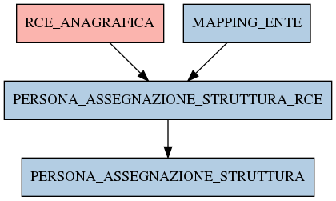

# PERSONA_ASSEGNAZIONE_STRUTTURA_RCE

## Info tabella

| Info                     | Descrizione                                                                                                                 |
|:-------------------------|:----------------------------------------------------------------------------------------------------------------------------|
| Nome tabella Dremio      | PERSONA_ASSEGNAZIONE_STRUTTURA_RCE                                                                                          |
| Space Dremio             | fbk_test1__MASTER_DATA                                                                                                      |
| Nome completo            | fbk_test1__MASTER_DATA.PERSONA_ASSEGNAZIONE_STRUTTURA_RCE                                                                   |
| Descrizione tabella      |                                                                                                                             |
| Versione                 | 1.0                                                                                                                         |
| Core dataset             | False                                                                                                                       |
| Dataset di origine       |                                                                                                                             |
| Richiede validazione     | False                                                                                                                       |
| Esposta in DSS           | False                                                                                                                       |
| Endpoint DSS             |                                                                                                                             |
| Query name DSS           |                                                                                                                             |
| Formato esposizione      |                                                                                                                             |
| Tipologia autenticazione |                                                                                                                             |
| Tabelle genitrici        | [fbk_test1__CORE_DATASET.RCE_ANAGRAFICA](/fbk_test1__CORE_DATASET/RCE_ANAGRAFICA/markdown.md)                               |
|                          | [fbk_test1__MASTER_DATA.MAPPING_ENTE](/fbk_test1__MASTER_DATA/MAPPING_ENTE/markdown.md)                                     |
| Tabelle figlie           | [fbk_test1__MASTER_DATA.PERSONA_ASSEGNAZIONE_STRUTTURA](/fbk_test1__MASTER_DATA/PERSONA_ASSEGNAZIONE_STRUTTURA/markdown.md) |

## Struttura relazionale

## Descrizione struttura tabella

| Campo                                    | Descrizione                              | Tipo    | Constraints   | Linked data   | errors   |
|:-----------------------------------------|:-----------------------------------------|:--------|:--------------|:--------------|:---------|
| codice_ente                              | Codice ente                              | integer | {}            |               | {}       |
| matricola                                | Matricola                                | integer | {}            |               | {}       |
| data_inizio_assegnazione_struttura       | Data inizio assegnazione struttura       | date    | {}            |               | {}       |
| data_fine_assegnazione_struttura         | Data fine assegnazione struttura         | date    | {}            |               | {}       |
| tipo_assegnazione_struttura              | Tipo assegnazione struttura              | string  | {}            |               | {}       |
| codice_struttura                         | Codice struttura                         | string  | {}            |               | {}       |
| data_inserimento_assegnazione_struttura  | Data inserimento assegnazione struttura  | date    | {}            |               | {}       |
| data_applicazione_assegnazione_struttura | Data applicazione assegnazione struttura | date    | {}            |               | {}       |
| matricola_estesa                         | Matricola estesa                         | string  | {}            |               | {}       |
