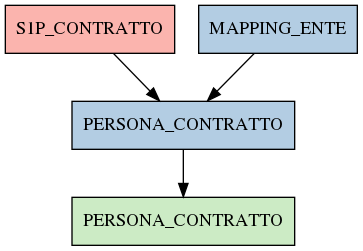

# PERSONA_CONTRATTO

## Info tabella

| Info                     | Descrizione                                                                                                                       |
|:-------------------------|:----------------------------------------------------------------------------------------------------------------------------------|
| Nome tabella Dremio      | PERSONA_CONTRATTO                                                                                                                 |
| Space Dremio             | fbk_test1__MASTER_DATA                                                                                                            |
| Nome completo            | fbk_test1__MASTER_DATA.PERSONA_CONTRATTO                                                                                          |
| Descrizione tabella      |                                                                                                                                   |
| Versione                 | 1.0                                                                                                                               |
| Core dataset             | False                                                                                                                             |
| Dataset di origine       |                                                                                                                                   |
| Richiede validazione     | True                                                                                                                              |
| Esposta in DSS           | False                                                                                                                             |
| Endpoint DSS             |                                                                                                                                   |
| Query name DSS           |                                                                                                                                   |
| Formato esposizione      |                                                                                                                                   |
| Tipologia autenticazione |                                                                                                                                   |
| Tabelle genitrici        | [fbk_test1__CORE_DATASET.S1P_CONTRATTO](/Documentation/fbk_test1__CORE_DATASET/S1P_CONTRATTO/markdown.md)                         |
|                          | [fbk_test1__MASTER_DATA.MAPPING_ENTE](/Documentation/fbk_test1__MASTER_DATA/MAPPING_ENTE/markdown.md)                             |
| Tabelle figlie           | [fbk_test1__VISUALIZATION_TABLES.PERSONA_CONTRATTO](/Documentation/fbk_test1__VISUALIZATION_TABLES/PERSONA_CONTRATTO/markdown.md) |

## Struttura relazionale

## Descrizione struttura tabella

| Campo                                  | Descrizione                            | Tipo    | Constraints   | Linked data   | errors   |
|:---------------------------------------|:---------------------------------------|:--------|:--------------|:--------------|:---------|
| codice_ente                            | Codice ente                            | integer | {}            |               | {}       |
| matricola                              | Matricola                              | integer | {}            |               | {}       |
| data_inizio_rapporto                   | Data inizio rapporto                   | date    | {}            |               | {}       |
| data_fine_rapporto                     | Data fine rapporto                     | date    | {}            |               | {}       |
| tipo_rapporto                          | Tipo rapporto                          | string  | {}            |               | {}       |
| codice_area_contrattuale_rapporto      | Codice area contrattuale rapporto      | integer | {}            |               | {}       |
| descrizione_area_contrattuale_rapporto | Descrizione area contrattuale rapporto | string  | {}            |               | {}       |
| data_inserimento_rapporto              | Data inserimento rapporto              | date    | {}            |               | {}       |
| data_applicazione_rapporto             | Data applicazione rapporto             | date    | {}            |               | {}       |
| matricola_estesa                       | Matricola estesa                       | string  | {}            |               | {}       |
