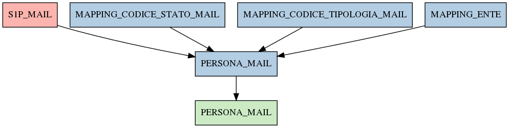

# PERSONA_MAIL

## Info tabella

| Info                     | Descrizione                                                                                                               |
|:-------------------------|:--------------------------------------------------------------------------------------------------------------------------|
| Nome tabella Dremio      | PERSONA_MAIL                                                                                                              |
| Space Dremio             | fbk_test1__MASTER_DATA                                                                                                    |
| Nome completo            | fbk_test1__MASTER_DATA.PERSONA_MAIL                                                                                       |
| Descrizione tabella      |                                                                                                                           |
| Versione                 | 1.0                                                                                                                       |
| Core dataset             | False                                                                                                                     |
| Dataset di origine       |                                                                                                                           |
| Richiede validazione     | False                                                                                                                     |
| Esposta in DSS           | False                                                                                                                     |
| Endpoint DSS             |                                                                                                                           |
| Query name DSS           |                                                                                                                           |
| Formato esposizione      |                                                                                                                           |
| Tipologia autenticazione |                                                                                                                           |
| Tabelle genitrici        | [fbk_test1__CORE_DATASET.S1P_MAIL](/fbk_test1__CORE_DATASET/S1P_MAIL/markdown.md)                                         |
|                          | [fbk_test1__MASTER_DATA.MAPPING_CODICE_STATO_MAIL](/fbk_test1__MASTER_DATA/MAPPING_CODICE_STATO_MAIL/markdown.md)         |
|                          | [fbk_test1__MASTER_DATA.MAPPING_CODICE_TIPOLOGIA_MAIL](/fbk_test1__MASTER_DATA/MAPPING_CODICE_TIPOLOGIA_MAIL/markdown.md) |
|                          | [fbk_test1__MASTER_DATA.MAPPING_ENTE](/fbk_test1__MASTER_DATA/MAPPING_ENTE/markdown.md)                                   |
| Tabelle figlie           | [fbk_test1__VISUALIZATION_TABLES.PERSONA_MAIL](/fbk_test1__VISUALIZATION_TABLES/PERSONA_MAIL/markdown.md)                 |

## Struttura relazionale

## Descrizione struttura tabella

| Campo                      | Descrizione                | Tipo    | Constraints   | Linked data   | errors   |
|:---------------------------|:---------------------------|:--------|:--------------|:--------------|:---------|
| codice_ente                | Codice ente                | integer | {}            |               | {}       |
| matricola                  | Matricola                  | integer | {}            |               | {}       |
| data_inizio_validita_mail  | Data inizio validita mail  | date    | {}            |               | {}       |
| data_fine_validita_mail    | Data fine validita mail    | date    | {}            |               | {}       |
| mail_istituzionale         | Mail istituzionale         | string  | {}            |               | {}       |
| codice_stato_mail          | Codice stato mail          | string  | {}            |               | {}       |
| codice_tipologia_mail      | Codice tipologia mail      | string  | {}            |               | {}       |
| indicatore_backup_mail     | Indicatore backup mail     | integer | {}            |               | {}       |
| scelta_invio_comunicazioni | Scelta invio comunicazioni | integer | {}            |               | {}       |
| matricola_estesa           | Matricola estesa           | string  | {}            |               | {}       |
| descrizione_stato_mail     | Descrizione stato mail     | string  | {}            |               | {}       |
| descrizione_tipologia_mail | Descrizione tipologia mail | string  | {}            |               | {}       |
