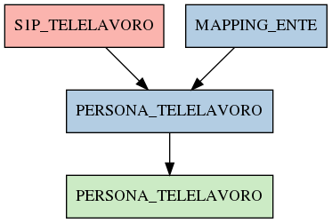

# PERSONA_TELELAVORO

## Info tabella

| Info                     | Descrizione                                                                                                                         |
|:-------------------------|:------------------------------------------------------------------------------------------------------------------------------------|
| Nome tabella Dremio      | PERSONA_TELELAVORO                                                                                                                  |
| Space Dremio             | fbk_test1__MASTER_DATA                                                                                                              |
| Nome completo            | fbk_test1__MASTER_DATA.PERSONA_TELELAVORO                                                                                           |
| Descrizione tabella      |                                                                                                                                     |
| Versione                 | 1.0                                                                                                                                 |
| Core dataset             | False                                                                                                                               |
| Dataset di origine       |                                                                                                                                     |
| Richiede validazione     | True                                                                                                                                |
| Esposta in DSS           | False                                                                                                                               |
| Endpoint DSS             |                                                                                                                                     |
| Query name DSS           |                                                                                                                                     |
| Formato esposizione      |                                                                                                                                     |
| Tipologia autenticazione |                                                                                                                                     |
| Tabelle genitrici        | [fbk_test1__CORE_DATASET.S1P_TELELAVORO](/Documentation/fbk_test1__CORE_DATASET/S1P_TELELAVORO/markdown.md)                         |
|                          | [fbk_test1__MASTER_DATA.MAPPING_ENTE](/Documentation/fbk_test1__MASTER_DATA/MAPPING_ENTE/markdown.md)                               |
| Tabelle figlie           | [fbk_test1__VISUALIZATION_TABLES.PERSONA_TELELAVORO](/Documentation/fbk_test1__VISUALIZATION_TABLES/PERSONA_TELELAVORO/markdown.md) |

## Struttura relazionale

## Descrizione struttura tabella

| Campo                        | Descrizione                  | Tipo    | Constraints   | Linked data   | errors   |
|:-----------------------------|:-----------------------------|:--------|:--------------|:--------------|:---------|
| codice_ente                  | Codice ente                  | integer | {}            |               | {}       |
| matricola                    | Matricola                    | integer | {}            |               | {}       |
| data_inizio_telelavoro       | Data inizio telelavoro       | date    | {}            |               | {}       |
| data_fine_telelavoro         | Data fine telelavoro         | date    | {}            |               | {}       |
| tipo_telelavoro              | Tipo telelavoro              | string  | {}            |               | {}       |
| descrizione_telelavoro       | Descrizione telelavoro       | string  | {}            |               | {}       |
| data_inserimento_telelavoro  | Data inserimento telelavoro  | date    | {}            |               | {}       |
| data_applicazione_telelavoro | Data applicazione telelavoro | date    | {}            |               | {}       |
| matricola_estesa             | Matricola estesa             | string  | {}            |               | {}       |
