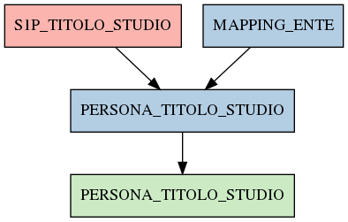

# PERSONA_TITOLO_STUDIO

## Info tabella

| Info                     | Descrizione                                                                                                                 |
|:-------------------------|:----------------------------------------------------------------------------------------------------------------------------|
| Nome tabella Dremio      | PERSONA_TITOLO_STUDIO                                                                                                       |
| Space Dremio             | fbk_test1__MASTER_DATA                                                                                                      |
| Nome completo            | fbk_test1__MASTER_DATA.PERSONA_TITOLO_STUDIO                                                                                |
| Descrizione tabella      |                                                                                                                             |
| Versione                 | 1.0                                                                                                                         |
| Core dataset             | False                                                                                                                       |
| Dataset di origine       |                                                                                                                             |
| Richiede validazione     | False                                                                                                                       |
| Esposta in DSS           | False                                                                                                                       |
| Endpoint DSS             |                                                                                                                             |
| Query name DSS           |                                                                                                                             |
| Formato esposizione      |                                                                                                                             |
| Tipologia autenticazione |                                                                                                                             |
| Tabelle genitrici        | [fbk_test1__CORE_DATASET.S1P_TITOLO_STUDIO](/fbk_test1__CORE_DATASET/S1P_TITOLO_STUDIO/markdown.md)                         |
|                          | [fbk_test1__MASTER_DATA.MAPPING_ENTE](/fbk_test1__MASTER_DATA/MAPPING_ENTE/markdown.md)                                     |
| Tabelle figlie           | [fbk_test1__VISUALIZATION_TABLES.PERSONA_TITOLO_STUDIO](/fbk_test1__VISUALIZATION_TABLES/PERSONA_TITOLO_STUDIO/markdown.md) |

## Struttura relazionale

## Descrizione struttura tabella

| Campo                     | Descrizione               | Tipo    | Constraints   | Linked data   | errors   |
|:--------------------------|:--------------------------|:--------|:--------------|:--------------|:---------|
| codice_ente               | Codice ente               | integer | {}            |               | {}       |
| matricola                 | Matricola                 | integer | {}            |               | {}       |
| data_inizio_titolo_studio | Data inizio titolo studio | date    | {}            |               | {}       |
| codice_titolo_studio      | Codice titolo studio      | string  | {}            |               | {}       |
| descrizione_titolo_studio | Descrizione titolo studio | string  | {}            |               | {}       |
| matricola_estesa          | Matricola estesa          | string  | {}            |               | {}       |
