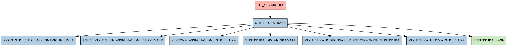

# STRUTTURA_BASE

## Info tabella

| Info                     | Descrizione                                                                                                                                               |
|:-------------------------|:----------------------------------------------------------------------------------------------------------------------------------------------------------|
| Nome tabella Dremio      | STRUTTURA_BASE                                                                                                                                            |
| Space Dremio             | fbk_test1__MASTER_DATA                                                                                                                                    |
| Nome completo            | fbk_test1__MASTER_DATA.STRUTTURA_BASE                                                                                                                     |
| Descrizione tabella      |                                                                                                                                                           |
| Versione                 | 1.0                                                                                                                                                       |
| Core dataset             | False                                                                                                                                                     |
| Dataset di origine       |                                                                                                                                                           |
| Richiede validazione     | False                                                                                                                                                     |
| Esposta in DSS           | False                                                                                                                                                     |
| Endpoint DSS             |                                                                                                                                                           |
| Query name DSS           |                                                                                                                                                           |
| Formato esposizione      |                                                                                                                                                           |
| Tipologia autenticazione |                                                                                                                                                           |
| Tabelle genitrici        | [fbk_test1__CORE_DATASET.S1P_GERARCHIA](/fbk_test1__CORE_DATASET/S1P_GERARCHIA/markdown.md)                                                               |
| Tabelle figlie           | [fbk_test1__MASTER_DATA.ASSET_STRUTTURE_ASSEGNAZIONE_LINEA](/fbk_test1__MASTER_DATA/ASSET_STRUTTURE_ASSEGNAZIONE_LINEA/markdown.md)                       |
|                          | [fbk_test1__MASTER_DATA.ASSET_STRUTTURE_ASSEGNAZIONE_TERMINALE](/fbk_test1__MASTER_DATA/ASSET_STRUTTURE_ASSEGNAZIONE_TERMINALE/markdown.md)               |
|                          | [fbk_test1__MASTER_DATA.PERSONA_ASSEGNAZIONE_STRUTTURA](/fbk_test1__MASTER_DATA/PERSONA_ASSEGNAZIONE_STRUTTURA/markdown.md)                               |
|                          | [fbk_test1__MASTER_DATA.STRUTTURA_ORGANIGRAMMA](/fbk_test1__MASTER_DATA/STRUTTURA_ORGANIGRAMMA/markdown.md)                                               |
|                          | [fbk_test1__MASTER_DATA.STRUTTURA_RESPONSABILE_ASSEGNAZIONE_STRUTTURA](/fbk_test1__MASTER_DATA/STRUTTURA_RESPONSABILE_ASSEGNAZIONE_STRUTTURA/markdown.md) |
|                          | [fbk_test1__MASTER_DATA.STRUTTURA_ULTIMA_STRUTTURA](/fbk_test1__MASTER_DATA/STRUTTURA_ULTIMA_STRUTTURA/markdown.md)                                       |
|                          | [fbk_test1__VISUALIZATION_TABLES.STRUTTURA_BASE](/fbk_test1__VISUALIZATION_TABLES/STRUTTURA_BASE/markdown.md)                                             |

## Struttura relazionale

## Descrizione struttura tabella

| Campo                 | Descrizione           | Tipo    | Constraints   | Linked data   | errors   |
|:----------------------|:----------------------|:--------|:--------------|:--------------|:---------|
| codice_struttura      | Codice struttura      | string  | {}            |               | {}       |
| tipo_struttura        | Tipo struttura        | string  | {}            |               | {}       |
| descrizione_struttura | Descrizione struttura | string  | {}            |               | {}       |
| livello_struttura     | Livello struttura     | integer | {}            |               | {}       |
| data_inizio_struttura | Data inizio struttura | date    | {}            |               | {}       |
| data_fine_struttura   | Data fine struttura   | date    | {}            |               | {}       |
| id_struttura          | Id struttura          | integer | {}            |               | {}       |
