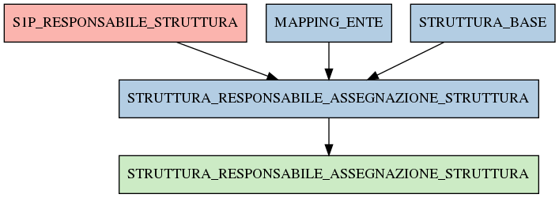

# STRUTTURA_RESPONSABILE_ASSEGNAZIONE_STRUTTURA

## Info tabella

| Info                     | Descrizione                                                                                                                                                                 |
|:-------------------------|:----------------------------------------------------------------------------------------------------------------------------------------------------------------------------|
| Nome tabella Dremio      | STRUTTURA_RESPONSABILE_ASSEGNAZIONE_STRUTTURA                                                                                                                               |
| Space Dremio             | fbk_test1__MASTER_DATA                                                                                                                                                      |
| Nome completo            | fbk_test1__MASTER_DATA.STRUTTURA_RESPONSABILE_ASSEGNAZIONE_STRUTTURA                                                                                                        |
| Descrizione tabella      |                                                                                                                                                                             |
| Versione                 | 1.0                                                                                                                                                                         |
| Core dataset             | False                                                                                                                                                                       |
| Dataset di origine       |                                                                                                                                                                             |
| Richiede validazione     | False                                                                                                                                                                       |
| Esposta in DSS           | False                                                                                                                                                                       |
| Endpoint DSS             |                                                                                                                                                                             |
| Query name DSS           |                                                                                                                                                                             |
| Formato esposizione      |                                                                                                                                                                             |
| Tipologia autenticazione |                                                                                                                                                                             |
| Tabelle genitrici        | [fbk_test1__CORE_DATASET.S1P_RESPONSABILE_STRUTTURA](/fbk_test1__CORE_DATASET/S1P_RESPONSABILE_STRUTTURA/markdown.md)                                                       |
|                          | [fbk_test1__MASTER_DATA.MAPPING_ENTE](/fbk_test1__MASTER_DATA/MAPPING_ENTE/markdown.md)                                                                                     |
|                          | [fbk_test1__MASTER_DATA.STRUTTURA_BASE](/fbk_test1__MASTER_DATA/STRUTTURA_BASE/markdown.md)                                                                                 |
| Tabelle figlie           | [fbk_test1__VISUALIZATION_TABLES.STRUTTURA_RESPONSABILE_ASSEGNAZIONE_STRUTTURA](/fbk_test1__VISUALIZATION_TABLES/STRUTTURA_RESPONSABILE_ASSEGNAZIONE_STRUTTURA/markdown.md) |

## Struttura relazionale

## Descrizione struttura tabella

| Campo                    | Descrizione              | Tipo    | Constraints   | Linked data   | errors   |
|:-------------------------|:-------------------------|:--------|:--------------|:--------------|:---------|
| codice_struttura         | Codice struttura         | string  | {}            |               | {}       |
| codice_ente              | Codice ente              | integer | {}            |               | {}       |
| matricola                | Matricola                | integer | {}            |               | {}       |
| incarico_funzionale      | Incarico funzionale      | string  | {}            |               | {}       |
| data_inizio_responsabile | Data inizio responsabile | date    | {}            |               | {}       |
| data_fine_responsabile   | Data fine responsabile   | date    | {}            |               | {}       |
| matricola_estesa         | Matricola estesa         | string  | {}            |               | {}       |
| id_struttura             | Id struttura             | integer | {}            |               | {}       |
