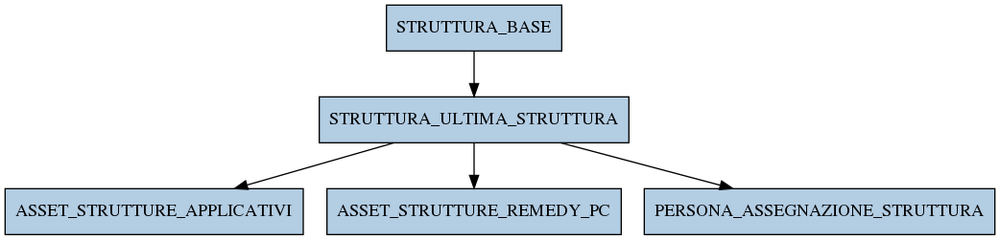

# STRUTTURA_ULTIMA_STRUTTURA

## Info tabella

| Info                     | Descrizione                                                                                                                 |
|:-------------------------|:----------------------------------------------------------------------------------------------------------------------------|
| Nome tabella Dremio      | STRUTTURA_ULTIMA_STRUTTURA                                                                                                  |
| Space Dremio             | fbk_test1__MASTER_DATA                                                                                                      |
| Nome completo            | fbk_test1__MASTER_DATA.STRUTTURA_ULTIMA_STRUTTURA                                                                           |
| Descrizione tabella      |                                                                                                                             |
| Versione                 | 1.0                                                                                                                         |
| Core dataset             | False                                                                                                                       |
| Dataset di origine       |                                                                                                                             |
| Richiede validazione     | False                                                                                                                       |
| Esposta in DSS           | False                                                                                                                       |
| Endpoint DSS             |                                                                                                                             |
| Query name DSS           |                                                                                                                             |
| Formato esposizione      |                                                                                                                             |
| Tipologia autenticazione |                                                                                                                             |
| Tabelle genitrici        | [fbk_test1__MASTER_DATA.STRUTTURA_BASE](/fbk_test1__MASTER_DATA/STRUTTURA_BASE/markdown.md)                                 |
| Tabelle figlie           | [fbk_test1__MASTER_DATA.ASSET_STRUTTURE_APPLICATIVI](/fbk_test1__MASTER_DATA/ASSET_STRUTTURE_APPLICATIVI/markdown.md)       |
|                          | [fbk_test1__MASTER_DATA.ASSET_STRUTTURE_REMEDY_PC](/fbk_test1__MASTER_DATA/ASSET_STRUTTURE_REMEDY_PC/markdown.md)           |
|                          | [fbk_test1__MASTER_DATA.PERSONA_ASSEGNAZIONE_STRUTTURA](/fbk_test1__MASTER_DATA/PERSONA_ASSEGNAZIONE_STRUTTURA/markdown.md) |

## Struttura relazionale

## Descrizione struttura tabella

| Campo                 | Descrizione           | Tipo    | Constraints   | Linked data   | errors   |
|:----------------------|:----------------------|:--------|:--------------|:--------------|:---------|
| codice_struttura      | Codice struttura      | string  | {}            |               | {}       |
| tipo_struttura        | Tipo struttura        | string  | {}            |               | {}       |
| descrizione_struttura | Descrizione struttura | string  | {}            |               | {}       |
| livello_struttura     | Livello struttura     | integer | {}            |               | {}       |
| data_inizio_struttura | Data inizio struttura | date    | {}            |               | {}       |
| data_fine_struttura   | Data fine struttura   | date    | {}            |               | {}       |
| id_struttura          | Id struttura          | integer | {}            |               | {}       |
| ranked_history        | Ranked history        | integer | {}            |               | {}       |
