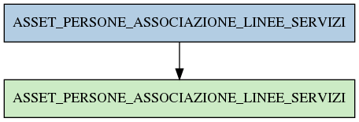

# ASSET_PERSONE_ASSOCIAZIONE_LINEE_SERVIZI

## Info tabella

| Info                     | Descrizione                                                                                                                                     |
|:-------------------------|:------------------------------------------------------------------------------------------------------------------------------------------------|
| Nome tabella Dremio      | ASSET_PERSONE_ASSOCIAZIONE_LINEE_SERVIZI                                                                                                        |
| Space Dremio             | fbk_test1__VISUALIZATION_TABLES                                                                                                                 |
| Nome completo            | fbk_test1__VISUALIZATION_TABLES.ASSET_PERSONE_ASSOCIAZIONE_LINEE_SERVIZI                                                                        |
| Descrizione tabella      |                                                                                                                                                 |
| Versione                 | 1.0                                                                                                                                             |
| Core dataset             | False                                                                                                                                           |
| Dataset di origine       |                                                                                                                                                 |
| Richiede validazione     | False                                                                                                                                           |
| Esposta in DSS           | True                                                                                                                                            |
| Endpoint DSS             | /asset-persone-associazione-linee-servizi                                                                                                       |
| Query name DSS           | asset_persone_associazione_linee_servizi                                                                                                        |
| Formato esposizione      | JSON                                                                                                                                            |
| Tipologia autenticazione | Bearer token                                                                                                                                    |
| Tabelle genitrici        | [fbk_test1__MASTER_DATA.ASSET_PERSONE_ASSOCIAZIONE_LINEE_SERVIZI](/fbk_test1__MASTER_DATA/ASSET_PERSONE_ASSOCIAZIONE_LINEE_SERVIZI/markdown.md) |
| Tabelle figlie           |                                                                                                                                                 |

## Struttura relazionale

## Descrizione struttura tabella

| Campo                             | Descrizione                       | Tipo     | Constraints   | Linked data   | errors   |
|:----------------------------------|:----------------------------------|:---------|:--------------|:--------------|:---------|
| linea_id                          | Linea id                          | integer  | {}            |               | {}       |
| numero_telefono                   | Numero telefono                   | string   | {}            |               | {}       |
| stato_linea                       | Stato linea                       | string   | {}            |               | {}       |
| data_fine_assegnazione_servizio   | Data fine assegnazione servizio   | datetime | {}            |               | {}       |
| data_inizio_assegnazione_servizio | Data inizio assegnazione servizio | datetime | {}            |               | {}       |
| descrizione_servizio              | Descrizione servizio              | string   | {}            |               | {}       |
| canone_servizio                   | Canone servizio                   | number   | {}            |               | {}       |
| codice_servizio                   | Codice servizio                   | string   | {}            |               | {}       |
| servizio_is_gratuito              | Servizio is gratuito              | integer  | {}            |               | {}       |
| tipo_canone_servizio              | Tipo canone servizio              | string   | {}            |               | {}       |
| codice_riferimento_contratto      | Codice riferimento contratto      | string   | {}            |               | {}       |
| descrizione_contratto             | Descrizione contratto             | string   | {}            |               | {}       |
