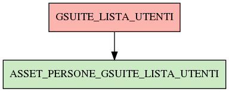

# ASSET_PERSONE_GSUITE_LISTA_UTENTI

## Info tabella

| Info                     | Descrizione                                                                                                           |
|:-------------------------|:----------------------------------------------------------------------------------------------------------------------|
| Nome tabella Dremio      | ASSET_PERSONE_GSUITE_LISTA_UTENTI                                                                                     |
| Space Dremio             | fbk_test1__VISUALIZATION_TABLES                                                                                       |
| Nome completo            | fbk_test1__VISUALIZATION_TABLES.ASSET_PERSONE_GSUITE_LISTA_UTENTI                                                     |
| Descrizione tabella      |                                                                                                                       |
| Versione                 | 1.0                                                                                                                   |
| Core dataset             | False                                                                                                                 |
| Dataset di origine       |                                                                                                                       |
| Richiede validazione     | False                                                                                                                 |
| Esposta in DSS           | True                                                                                                                  |
| Endpoint DSS             | /gsuite-utenti                                                                                                        |
| Query name DSS           | gsuite_utenti                                                                                                         |
| Formato esposizione      | JSON                                                                                                                  |
| Tipologia autenticazione | Bearer token                                                                                                          |
| Tabelle genitrici        | [fbk_test1__CORE_DATASET.GSUITE_LISTA_UTENTI](/Documentation/fbk_test1__CORE_DATASET/GSUITE_LISTA_UTENTI/markdown.md) |
| Tabelle figlie           |                                                                                                                       |

## Struttura relazionale

## Descrizione struttura tabella

| Campo                        | Descrizione                  | Tipo     | Constraints   | Linked data   | errors   |
|:-----------------------------|:-----------------------------|:---------|:--------------|:--------------|:---------|
| mail_istituzionale           | Mail istituzionale           | string   | {}            |               | {}       |
| mail_istituzionale_2         | Mail istituzionale 2         | string   | {}            |               | {}       |
| mail_istituzionale_3         | Mail istituzionale 3         | string   | {}            |               | {}       |
| mail_istituzionale_4         | Mail istituzionale 4         | string   | {}            |               | {}       |
| mail_istituzionale_5         | Mail istituzionale 5         | string   | {}            |               | {}       |
| mail_istituzionale_6         | Mail istituzionale 6         | string   | {}            |               | {}       |
| gsuite_data_creazione_utente | Gsuite data creazione utente | datetime | {}            |               | {}       |
| gsuite_ultimo_login          | Gsuite ultimo login          | datetime | {}            |               | {}       |
| gsuite_cognome               | Gsuite cognome               | string   | {}            |               | {}       |
| gsuite_nome                  | Gsuite nome                  | string   | {}            |               | {}       |
| gsuite_org_unit_path         | Gsuite org unit path         | string   | {}            |               | {}       |
| gsuite_sospeso               | Gsuite sospeso               | integer  | {}            |               | {}       |
