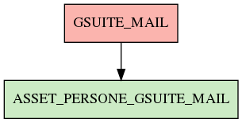

# ASSET_PERSONE_GSUITE_MAIL

## Info tabella

| Info                     | Descrizione                                                                             |
|:-------------------------|:----------------------------------------------------------------------------------------|
| Nome tabella Dremio      | ASSET_PERSONE_GSUITE_MAIL                                                               |
| Space Dremio             | fbk_test1__VISUALIZATION_TABLES                                                         |
| Nome completo            | fbk_test1__VISUALIZATION_TABLES.ASSET_PERSONE_GSUITE_MAIL                               |
| Descrizione tabella      |                                                                                         |
| Versione                 | 1.0                                                                                     |
| Core dataset             | False                                                                                   |
| Dataset di origine       |                                                                                         |
| Richiede validazione     | False                                                                                   |
| Esposta in DSS           | True                                                                                    |
| Endpoint DSS             | /gsuite-mail                                                                            |
| Query name DSS           | gsuite_mail                                                                             |
| Formato esposizione      | JSON                                                                                    |
| Tipologia autenticazione | Bearer token                                                                            |
| Tabelle genitrici        | [fbk_test1__CORE_DATASET.GSUITE_MAIL](/fbk_test1__CORE_DATASET/GSUITE_MAIL/markdown.md) |
| Tabelle figlie           |                                                                                         |

## Struttura relazionale

## Descrizione struttura tabella

| Campo                         | Descrizione                   | Tipo     | Constraints   | Linked data   | errors   |
|:------------------------------|:------------------------------|:---------|:--------------|:--------------|:---------|
| mail_istituzionale            | Mail istituzionale            | string   | {}            |               | {}       |
| gsuite_data_aggregazione_mail | Gsuite data aggregazione mail | datetime | {}            |               | {}       |
| gsuite_mail_inviate           | Gsuite mail inviate           | integer  | {}            |               | {}       |
| gsuite_mail_ricevute          | Gsuite mail ricevute          | integer  | {}            |               | {}       |
