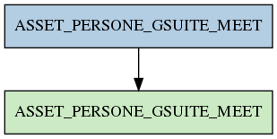

# ASSET_PERSONE_GSUITE_MEET

## Info tabella

| Info                     | Descrizione                                                                                                                     |
|:-------------------------|:--------------------------------------------------------------------------------------------------------------------------------|
| Nome tabella Dremio      | ASSET_PERSONE_GSUITE_MEET                                                                                                       |
| Space Dremio             | fbk_test1__VISUALIZATION_TABLES                                                                                                 |
| Nome completo            | fbk_test1__VISUALIZATION_TABLES.ASSET_PERSONE_GSUITE_MEET                                                                       |
| Descrizione tabella      |                                                                                                                                 |
| Versione                 | 1.0                                                                                                                             |
| Core dataset             | False                                                                                                                           |
| Dataset di origine       |                                                                                                                                 |
| Richiede validazione     | False                                                                                                                           |
| Esposta in DSS           | True                                                                                                                            |
| Endpoint DSS             | /gsuite-meet                                                                                                                    |
| Query name DSS           | gsuite_meet                                                                                                                     |
| Formato esposizione      | JSON                                                                                                                            |
| Tipologia autenticazione | Bearer token                                                                                                                    |
| Tabelle genitrici        | [fbk_test1__MASTER_DATA.ASSET_PERSONE_GSUITE_MEET](/Documentation/fbk_test1__MASTER_DATA/ASSET_PERSONE_GSUITE_MEET/markdown.md) |
| Tabelle figlie           |                                                                                                                                 |

## Struttura relazionale

## Descrizione struttura tabella

| Campo                            | Descrizione                      | Tipo     | Constraints   | Linked data   | errors   |
|:---------------------------------|:---------------------------------|:---------|:--------------|:--------------|:---------|
| gsuite_data_meet                 | Gsuite data meet                 | datetime | {}            |               | {}       |
| gsuite_codice_meet               | Gsuite codice meet               | string   | {}            |               | {}       |
| gsuite_mail_istituzionale        | Gsuite mail istituzionale        | string   | {}            |               | {}       |
| gsuite_durata_meet               | Gsuite durata meet               | integer  | {}            |               | {}       |
| gsuite_paese                     | Gsuite paese                     | string   | {}            |               | {}       |
| larghezza_banda_caricamento_kbps | Larghezza banda caricamento kbps | number   | {}            |               | {}       |
| larghezza_banda_download_kbps    | Larghezza banda download kbps    | number   | {}            |               | {}       |
