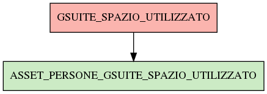

# ASSET_PERSONE_GSUITE_SPAZIO_UTILIZZATO

## Info tabella

| Info                     | Descrizione                                                                                                                     |
|:-------------------------|:--------------------------------------------------------------------------------------------------------------------------------|
| Nome tabella Dremio      | ASSET_PERSONE_GSUITE_SPAZIO_UTILIZZATO                                                                                          |
| Space Dremio             | fbk_test1__VISUALIZATION_TABLES                                                                                                 |
| Nome completo            | fbk_test1__VISUALIZATION_TABLES.ASSET_PERSONE_GSUITE_SPAZIO_UTILIZZATO                                                          |
| Descrizione tabella      |                                                                                                                                 |
| Versione                 | 1.0                                                                                                                             |
| Core dataset             | False                                                                                                                           |
| Dataset di origine       |                                                                                                                                 |
| Richiede validazione     | False                                                                                                                           |
| Esposta in DSS           | True                                                                                                                            |
| Endpoint DSS             | /gsuite-drive                                                                                                                   |
| Query name DSS           | gsuite_drive                                                                                                                    |
| Formato esposizione      | JSON                                                                                                                            |
| Tipologia autenticazione | Bearer token                                                                                                                    |
| Tabelle genitrici        | [fbk_test1__CORE_DATASET.GSUITE_SPAZIO_UTILIZZATO](/Documentation/fbk_test1__CORE_DATASET/GSUITE_SPAZIO_UTILIZZATO/markdown.md) |
| Tabelle figlie           |                                                                                                                                 |

## Struttura relazionale

## Descrizione struttura tabella

| Campo                             | Descrizione                       | Tipo   | Constraints   | Linked data   | errors   |
|:----------------------------------|:----------------------------------|:-------|:--------------|:--------------|:---------|
| mail_istituzionale                | Mail istituzionale                | string | {}            |               | {}       |
| gsuite_spazio_mail_utilizzato_gb  | Gsuite spazio mail utilizzato gb  | number | {}            |               | {}       |
| gsuite_spazio_drive_utilizzato_gb | Gsuite spazio drive utilizzato gb | number | {}            |               | {}       |
| gsuite_spazio_totale_gb           | Gsuite spazio totale gb           | number | {}            |               | {}       |
