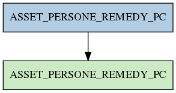

# ASSET_PERSONE_REMEDY_PC

## Info tabella

| Info                     | Descrizione                                                                                                   |
|:-------------------------|:--------------------------------------------------------------------------------------------------------------|
| Nome tabella Dremio      | ASSET_PERSONE_REMEDY_PC                                                                                       |
| Space Dremio             | fbk_test1__VISUALIZATION_TABLES                                                                               |
| Nome completo            | fbk_test1__VISUALIZATION_TABLES.ASSET_PERSONE_REMEDY_PC                                                       |
| Descrizione tabella      |                                                                                                               |
| Versione                 | 1.0                                                                                                           |
| Core dataset             | False                                                                                                         |
| Dataset di origine       |                                                                                                               |
| Richiede validazione     | False                                                                                                         |
| Esposta in DSS           | True                                                                                                          |
| Endpoint DSS             | /remedy-pdl-persone                                                                                           |
| Query name DSS           | remedy_pdl_anagrafiche                                                                                        |
| Formato esposizione      | JSON                                                                                                          |
| Tipologia autenticazione | Bearer token                                                                                                  |
| Tabelle genitrici        | [fbk_test1__MASTER_DATA.ASSET_PERSONE_REMEDY_PC](/fbk_test1__MASTER_DATA/ASSET_PERSONE_REMEDY_PC/markdown.md) |
| Tabelle figlie           |                                                                                                               |

## Struttura relazionale

## Descrizione struttura tabella

| Campo                         | Descrizione                   | Tipo     | Constraints   | Linked data   | errors   |
|:------------------------------|:------------------------------|:---------|:--------------|:--------------|:---------|
| pdl_id                        | Pdl id                        | string   | {}            |               | {}       |
| aid                           | Aid                           | string   | {}            |               | {}       |
| pdl_stato                     | Pdl stato                     | string   | {}            |               | {}       |
| pdl_codice_soggetto           | Pdl codice soggetto           | string   | {}            |               | {}       |
| pdl_codice_struttura          | Pdl codice struttura          | string   | {}            |               | {}       |
| pdl_descrizione_soggetto      | Pdl descrizione soggetto      | string   | {}            |               | {}       |
| pdl_descrizione_struttura     | Pdl descrizione struttura     | string   | {}            |               | {}       |
| pdl_dipartimento_appartenenza | Pdl dipartimento appartenenza | string   | {}            |               | {}       |
| pdl_cap                       | Pdl cap                       | string   | {}            |               | {}       |
| pdl_localita                  | Pdl localita                  | string   | {}            |               | {}       |
| pdl_indirizzo                 | Pdl indirizzo                 | string   | {}            |               | {}       |
| pdl_ubicazione                | Pdl ubicazione                | string   | {}            |               | {}       |
| pdl_piano                     | Pdl piano                     | string   | {}            |               | {}       |
| pdl_stanza                    | Pdl stanza                    | string   | {}            |               | {}       |
| pdl_cognome                   | Pdl cognome                   | string   | {}            |               | {}       |
| pdl_nome                      | Pdl nome                      | string   | {}            |               | {}       |
| pdl_data_installazione        | Pdl data installazione        | datetime | {}            |               | {}       |
| pdl_data_acquisto             | Pdl data acquisto             | datetime | {}            |               | {}       |
| pdl_tipo                      | Pdl tipo                      | string   | {}            |               | {}       |
| pdl_produttore                | Pdl produttore                | string   | {}            |               | {}       |
| pdl_modello                   | Pdl modello                   | string   | {}            |               | {}       |
| pdl_proprietario              | Pdl proprietario              | string   | {}            |               | {}       |
| pdl_desktop_management        | Pdl desktop management        | string   | {}            |               | {}       |
| pdl_fleet                     | Pdl fleet                     | string   | {}            |               | {}       |
| pdl_scadenza_fleet            | Pdl scadenza fleet            | string   | {}            |               | {}       |
| pdl_sistema_operativo         | Pdl sistema operativo         | string   | {}            |               | {}       |
| matricola_estesa              | Matricola estesa              | string   | {}            |               | {}       |
| id_struttura                  | Id struttura                  | integer  | {}            |               | {}       |
